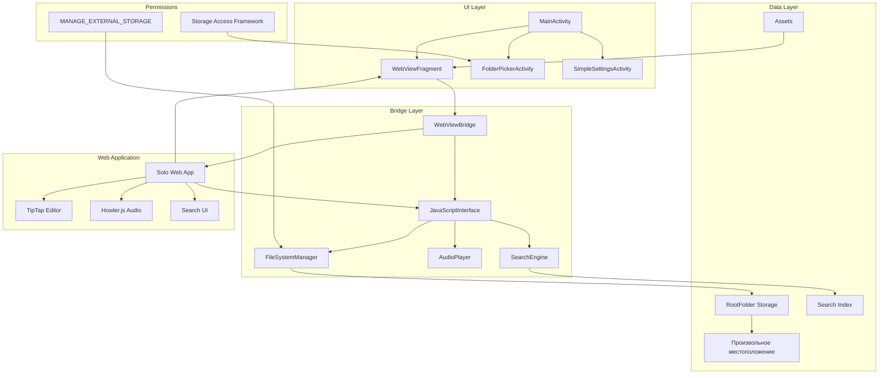
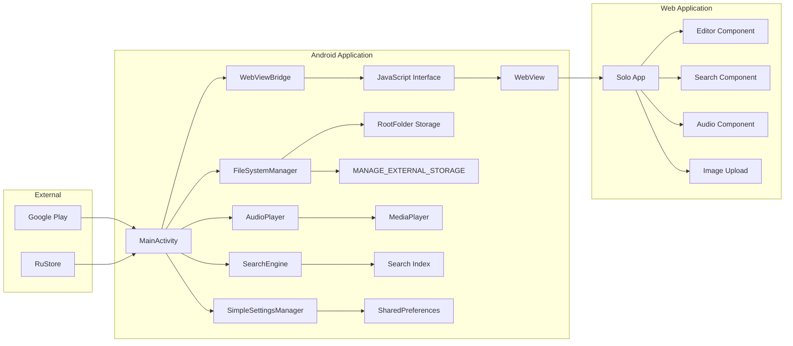
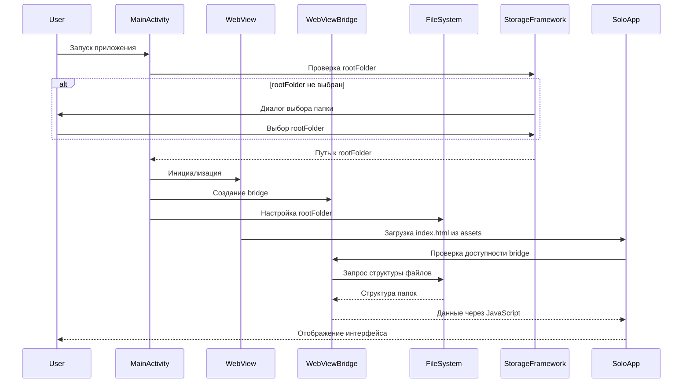
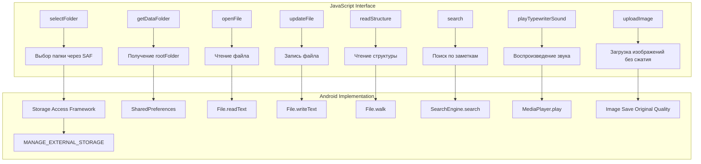
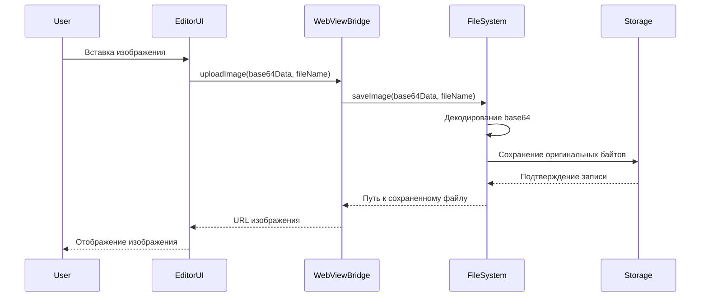
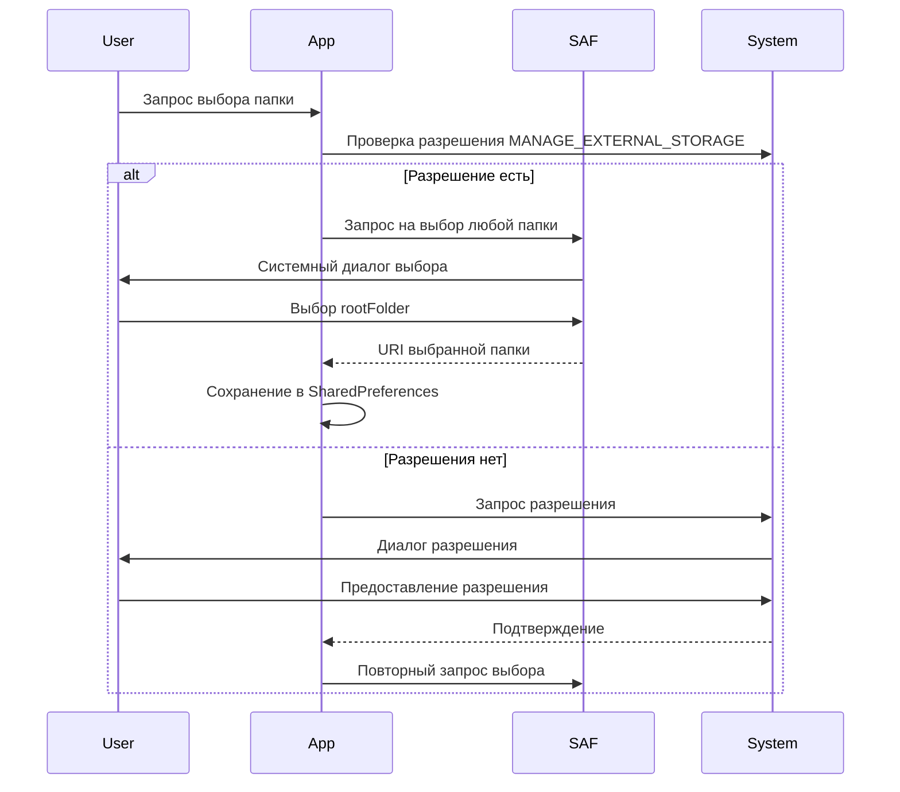
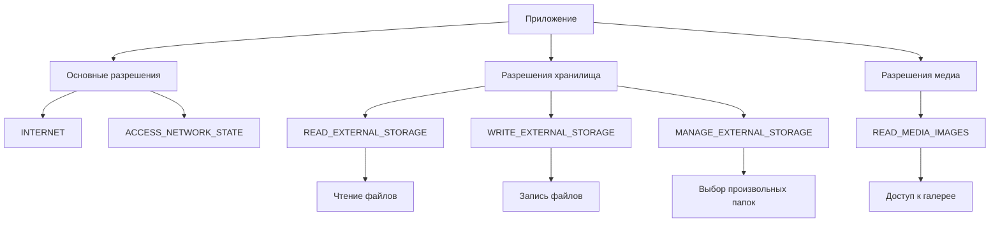

# Обновленная архитектура мобильного приложения Solo для Android

## Изменения архитектуры согласно требованиям

### Ключевые изменения:
1. **Упрощенный UI**: Удалены нативные UI компоненты, оставлен только WebView контейнер
2. **Произвольное хранилище**: Поддержка папки `rootFolder` в любом месте файловой системы
3. **Без сжатия изображений**: Сохранение оригинального качества изображений
4. **Без темной темы**: Только светлая тема
5. **Без аналитики**: Удалены системы мониторинга и аналитики
6. **Мульти-магазин**: Поддержка публикации в Google Play и RuStore

## Общая архитектура



## Компонентная диаграмма (упрощенная)



## Последовательность загрузки приложения (обновленная)



## Bridge API Диаграмма (обновленная)



## Структура проекта Android (обновленная)

```
solo/native-clients/android/
├── app/
│   ├── src/main/
│   │   ├── java/com/solo/
│   │   │   ├── MainActivity.kt
│   │   │   ├── bridge/
│   │   │   │   ├── WebViewBridge.kt
│   │   │   │   ├── FileSystemManager.kt
│   │   │   │   ├── AudioPlayer.kt
│   │   │   │   └── SearchEngine.kt
│   │   │   ├── ui/
│   │   │   │   ├── FolderPickerActivity.kt
│   │   │   │   └── SimpleSettingsActivity.kt
│   │   │   └── utils/
│   │   │       ├── PermissionHelper.kt
│   │   │       └── SecurityUtils.kt
│   │   ├── res/
│   │   │   ├── layout/
│   │   │   │   ├── activity_main.xml
│   │   │   │   ├── activity_folder_picker.xml
│   │   │   │   └── activity_settings.xml
│   │   │   └── values/
│   │   │       ├── colors.xml (только светлая тема)
│   │   │       └── strings.xml
│   │   └── assets/
│   │       ├── solo/          # Веб-приложение solo
│   │       │   ├── index.html
│   │       │   ├── assets/
│   │       │   └── ...
│   │       └── typewriter.mp3
│   ├── build.gradle.kts
│   └── AndroidManifest.xml
├── build.gradle.kts
└── settings.gradle.kts
```

## Поток данных при загрузке изображений (без сжатия)



## Поток выбора папки с MANAGE_EXTERNAL_STORAGE



## Технологический стек (обновленный)

| Компонент | Технология | Назначение | Изменения |
|-----------|------------|------------|-----------|
| Язык | Kotlin | Основной язык разработки | Без изменений |
| UI Framework | Jetpack Compose (минимально) | Базовый UI | Упрощен, удалены сложные компоненты |
| Архитектура | MVVM (упрощенная) | Организация кода | Удалена Clean Architecture для упрощения |
| Асинхронность | Kotlin Coroutines | Асинхронные операции | Без изменений |
| WebView | Android WebView + Accompanist | Отображение веб-приложения | Без изменений |
| Bridge | @JavascriptInterface | Коммуникация JS-Kotlin | Без изменений |
| Аудио | Android MediaPlayer | Воспроизведение звуков | Без изменений |
| Хранение | File API + SAF + MANAGE_EXTERNAL_STORAGE | Локальное хранение в произвольных папках | Добавлена поддержка произвольных путей |
| Поиск | Kotlin Sequence + Regex | Поиск по файлам | Без изменений |
| Разрешения | Android Permissions API | Управление разрешениями | Добавлен MANAGE_EXTERNAL_STORAGE |
| Публикация | Google Play + RuStore | Распространение приложения | Добавлена поддержка RuStore |

## Схема разрешений



## Модель безопасности

### Защита от path traversal:
```kotlin
fun isPathSafe(file: File): Boolean {
    val rootPath = rootFolder?.canonicalPath ?: return false
    val filePath = file.canonicalPath
    // Проверка, что файл находится внутри rootFolder
    return filePath.startsWith(rootPath)
}
```

### Обработка разрешений:
1. **Runtime permissions**: READ_EXTERNAL_STORAGE, WRITE_EXTERNAL_STORAGE
2. **Special permission**: MANAGE_EXTERNAL_STORAGE (требует ручного одобрения пользователем)
3. **Storage Access Framework**: Для выбора папок без MANAGE_EXTERNAL_STORAGE

### Изоляция данных:
- Все операции файловой системы ограничены `rootFolder`
- JavaScript bridge имеет доступ только к методам FileSystemManager
- Проверка всех путей на безопасность

## Конфигурация сборки для разных магазинов

### Google Play:
```gradle
android {
    defaultConfig {
        applicationId "com.solo.app"
        versionCode 1
        versionName "1.0"
    }
    
    buildTypes {
        release {
            minifyEnabled true
            proguardFiles getDefaultProguardFile('proguard-android-optimize.txt')
        }
    }
}
```

### RuStore:
```gradle
android {
    defaultConfig {
        applicationId "com.solo.app"
        versionCode 1
        versionName "1.0"
        // Специфичные настройки для RuStore
    }
    
    // Возможные дополнительные конфигурации
    flavorDimensions "store"
    productFlavors {
        googlePlay {
            dimension "store"
            // Настройки для Google Play
        }
        companyStore {
            dimension "store"
            // Настройки для RuStore
        }
    }
}
```

## Миграция с electron.ts на nativeBridge.ts

### Изменения в кодовой базе:
1. **Переименование файла**: `src/utils/electron.ts` → `src/utils/nativeBridge.ts`
2. **Обновление импортов**: Во всех файлах, импортирующих electron.ts
3. **Унификация API**: Создание общего интерфейса для Electron и Android
4. **Определение платформы**: Логика определения доступного API

### Новая структура nativeBridge.ts:
```typescript
// Общий интерфейс для всех платформ
interface NativeAPI {
    readStructure(): Promise<{success: boolean, structure?: FileNode[], error?: string}>;
    openFile(path: string): Promise<{success: boolean, content?: string, error?: string}>;
    updateFile(path: string, content: string): Promise<{success: boolean, error?: string}>;
    selectFolder(): Promise<{success: boolean, path?: string, error?: string}>;
    getDataFolder(): Promise<{success: boolean, path?: string, error?: string}>;
    playTypewriterSound(): Promise<void>;
    uploadImage(base64Data: string, fileName: string): Promise<{success: boolean, url?: string, error?: string}>;
}

// Определение доступного API
export function getPlatformAPI(): NativeAPI | null {
    if (window.electronAPI) {
        return window.electronAPI as NativeAPI;
    } else if (window.androidBridge) {
        return window.androidBridge as NativeAPI;
    } else {
        return null; // Веб-версия
    }
}
```

Эта обновленная архитектура отражает все изменения, запрошенные пользователем, и обеспечивает минималистичный, но функциональный подход к реализации Android версии Solo.