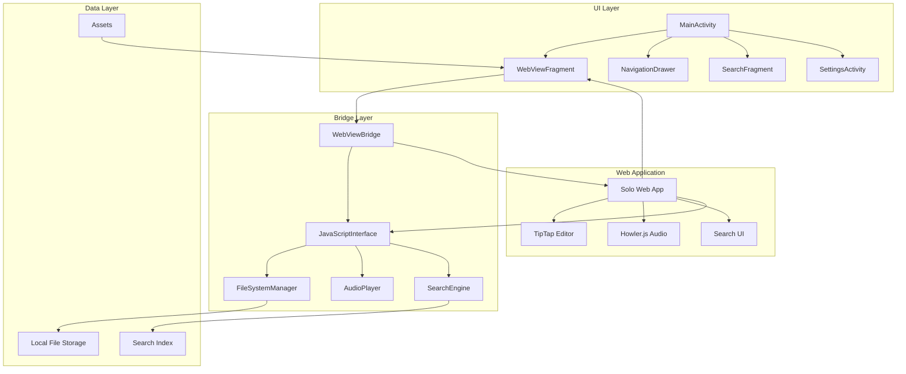
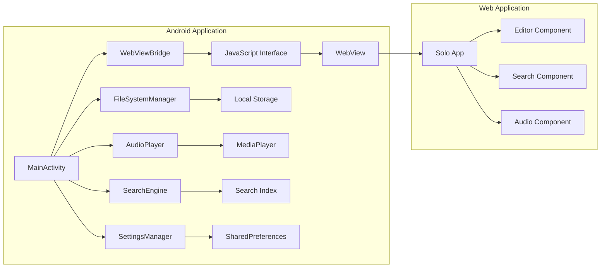
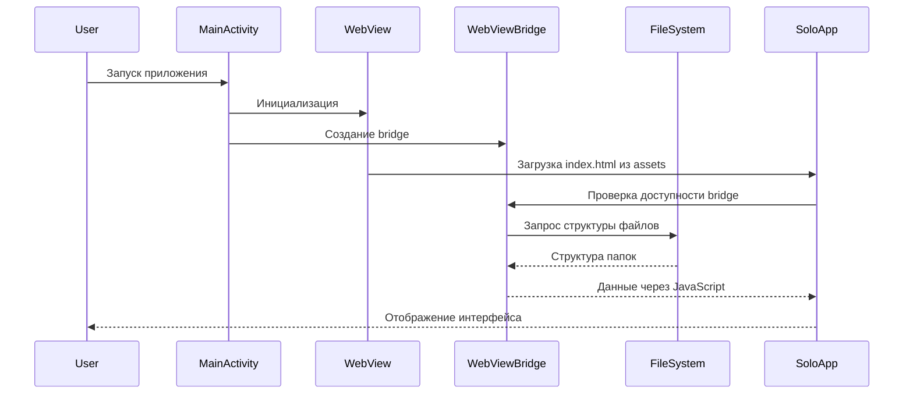
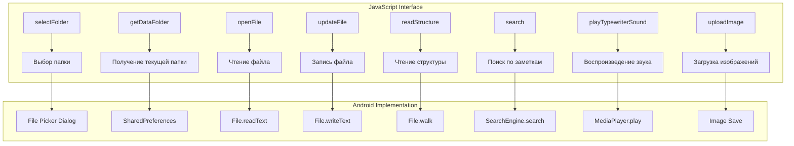
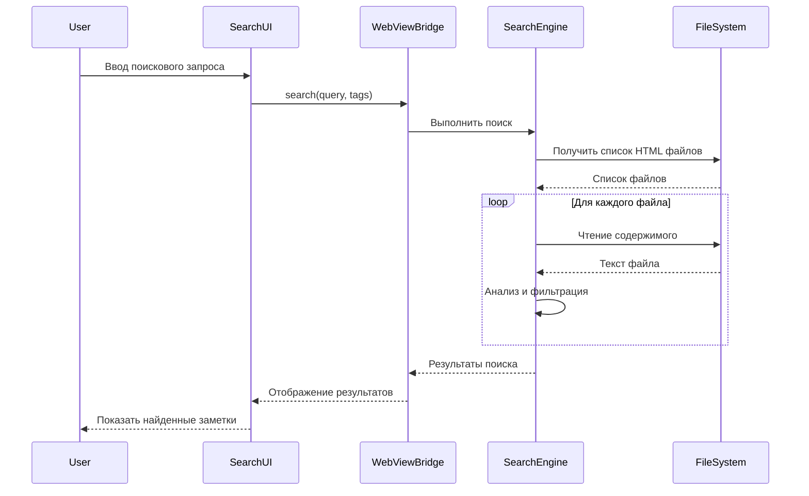

# Архитектура мобильного приложения Solo для Android

## Общая архитектура



## Компонентная диаграмма



## Последовательность загрузки приложения



## Bridge API Диаграмма



## Структура проекта Android

```
solo/native-clients/android/
├── app/
│   ├── src/main/
│   │   ├── java/com/solo/
│   │   │   ├── MainActivity.kt
│   │   │   ├── bridge/
│   │   │   │   ├── WebViewBridge.kt
│   │   │   │   ├── FileSystemManager.kt
│   │   │   │   ├── AudioPlayer.kt
│   │   │   │   └── SearchEngine.kt
│   │   │   ├── ui/
│   │   │   │   ├── components/
│   │   │   │   └── theme/
│   │   │   └── utils/
│   │   ├── res/
│   │   └── assets/
│   │       ├── solo/          # Веб-приложение solo
│   │       │   ├── index.html
│   │       │   ├── assets/
│   │       │   └── ...
│   │       └── typewriter.mp3
├── build.gradle.kts
└── settings.gradle.kts
```

## Поток данных при поиске



## Технологический стек

| Компонент | Технология | Назначение |
|-----------|------------|------------|
| Язык | Kotlin | Основной язык разработки |
| UI Framework | Jetpack Compose | Современный UI toolkit |
| Архитектура | MVVM + Clean Architecture | Организация кода |
| Асинхронность | Kotlin Coroutines + Flow | Асинхронные операции |
| WebView | Android WebView + Chrome Custom Tabs | Отображение веб-приложения |
| Bridge | @JavascriptInterface | Коммуникация JS-Kotlin |
| Аудио | Android MediaPlayer | Воспроизведение звуков |
| Хранение | File API + SharedPreferences | Локальное хранение данных |
| Поиск | Kotlin Sequence + Regex | Поиск по файлам |
| Навигация | Navigation Component | Навигация между экранами |
