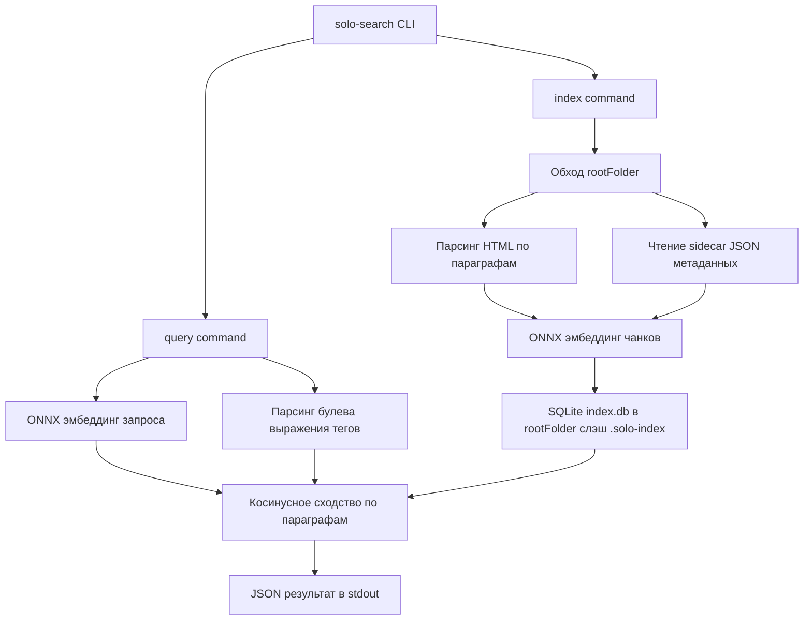

# План: Go CLI-инструмент семантического поиска (solo/instruments/semantic-search)

## Задача

Создать отдельную программу на Go в `solo/instruments`, которая:
- компилируется как CLI-инструмент для Ubuntu;
- принимает `rootFolder` и поисковый запрос (текст + опционально теги) и выполняет семантический поиск среди файлов в этой папке, используя *локальную* (offline) нейросетевую модель;
- принимает `rootFolder` и команду на перестройку индекса;
- ищет среди `.html` файлов заметок; рядом с каждым html лежит `.json` файл с тем же именем, содержащий метаданные (`tags`, `paragraphTags` и др. — важны для поиска).

Эта задача — Go/CLI-аналог существующего Electron-плана [`semantic-search.md`](../plans/semantic-search.md:1), но как самостоятельный переносимый бинарник без Node/Electron.

## Уточнённые решения

1. **Модель эмбеддингов**: ONNX Runtime через `onnxruntime-go` (github.com/yalue/onnxruntime_go), модель `all-MiniLM-L6-v2` в формате ONNX (совпадает по модели с Electron-планом, чтобы эмбеддинги были сопоставимы). Реализовано и проверено end-to-end с ONNX Runtime 1.26.0 и моделью/токенизатором из `Xenova/all-MiniLM-L6-v2` (HuggingFace).
2. **CLI-интерфейс**: один бинарник `solo-search` с подкомандами:
   - `solo-search index --root <dir> [--model-dir <dir>]` — построение/перестройка индекса;
   - `solo-search query --root <dir> [--query "<текст>"] [--tags "<булево выражение>"] [--model-dir <dir>]` — поиск. Должен быть указан хотя бы один из параметров `--query`/`--tags` (оба сразу тоже допустимы); если не указан ни один — ошибка.
   Результат выводится в stdout в виде JSON.
3. **Хранилище индекса**: SQLite-файл `<root>/.solo-index/index.db`, доступ без cgo через `modernc.org/sqlite` (единственная тяжёлая C-зависимость — сам ONNX Runtime).
4. **Модель/токенизатор**: файлы `model.onnx`, `tokenizer.json` и т.п. поставляются рядом с бинарником в папке `models/` (кладутся в репозиторий/дистрибутив вручную); путь переопределяется флагом `--model-dir` или переменной окружения (например, `SOLO_SEARCH_MODEL_DIR`).
5. **Чанкинг документов**: по параграфам. Каждый HTML-элемент `p`/`h1-h6`/`li` с атрибутом `data-tags` (см. [`ParagraphTags.ts`](../src/extensions/ParagraphTags.ts:30) и [`extractParagraphTags()`](../src/utils.tsx:6)) становится отдельным чанком со своими `paragraphTags`. Поиск возвращает конкретные параграфы-совпадения, а не весь файл целиком.
6. **Взаимодействие `--query` и `--tags`**: обязателен хотя бы один из параметров.
   - Указаны оба (`--query` и `--tags`): `--tags` работает как мягкий буст релевантности (не жёсткий AND-фильтр, не исключает результаты без тегов). Значение `--tags` — булево выражение над множеством тегов чанка/файла, например `foo AND (bar OR baz)`. Итоговая релевантность = семантическое сходство + буст за совпадение тег-выражения.
   - Указан только `--tags` (без `--query`): семантического ранжирования нет — `--tags` работает как жёсткий фильтр, отбирается только подмножество чанков/файлов, точно удовлетворяющее тег-выражению (результат сортируется, например, по дате или по пути, без score).
   - Указан только `--query` (без `--tags`): чистый семантический поиск без учёта тегов.
   - Если не указан ни один параметр — CLI возвращает ошибку валидации.

## Формат метаданных

Зеркалирует TS-тип [`FileMetadata`](../src/types.tsx:78):

```json
{
  "id": "string",
  "tags": ["string"],
  "createdAt": "ISO-date",
  "theme": "string (optional)",
  "paragraphTags": ["string"]
}
```

Для каждого `note.html` рядом лежит `note.json` — аналогично тому, как это уже реализовано в Electron-обработчиках ([`main.ts:709`](../native-clients/electron/electron/main.ts:709), [`main.ts:765`](../native-clients/electron/electron/main.ts:765)).

## Архитектура



## Структура модуля (план)

```
solo/instruments/semantic-search/
├── go.mod
├── README.md
├── Makefile                      # сборка под linux/amd64
├── models/                       # модель + токенизатор (руками положенные файлы)
├── cmd/solo-search/main.go       # разбор подкоманд index/query
└── internal/
    ├── embedding/                # ONNX загрузка модели, токенизация, mean-pooling
    ├── htmlparse/                # извлечение параграфов + data-tags
    ├── metadata/                 # чтение/структуры sidecar JSON
    ├── store/                    # SQLite схема и доступ к индексу
    ├── indexer/                  # обход rootFolder, инкрементальное обновление
    └── query/
        ├── tagexpr/               # парсер булевых выражений над тегами
        └── search/                # косинусное сходство + буст + топ-N
```

## Пошаговый план реализации

1. Инициализировать Go-модуль в `solo/instruments/semantic-search` (go.mod, базовая структура каталогов `cmd`/`internal`/`models`).
2. Реализовать CLI-обвязку в `cmd/solo-search/main.go`: разбор подкоманд `index` и `query`, общих флагов `--root`, `--model-dir` (и/или переменная окружения `SOLO_SEARCH_MODEL_DIR`).
3. Реализовать загрузку модели ONNX (`all-MiniLM-L6-v2`) и токенизатора через `onnxruntime-go`: `internal/embedding` (model.go, tokenizer.go, embedder.go) с mean-pooling и нормализацией вектора.
4. Реализовать парсер HTML-файлов заметок в `internal/htmlparse`: разбиение на параграфы (`p`, `h1-h6`, `li`), извлечение `data-tags` как `paragraphTags` для каждого параграфа.
5. Реализовать чтение sidecar JSON-метаданных (`internal/metadata`): структура `FileMetadata` (id, tags, createdAt, theme, paragraphTags), зеркалящая TS-тип `FileMetadata`.
6. Спроектировать и реализовать SQLite-хранилище индекса (`internal/store`): схема files/paragraphs/meta, инициализация БД в `<root>/.solo-index/index.db`, миграции при смене модели.
7. Реализовать индексатор (`internal/indexer`): обход `rootFolder`, хэширование файлов (html+json) для инкрементального обновления, эмбеддинг новых/изменённых параграфов, удаление записей для удалённых файлов.
8. Реализовать парсер булевых тег-выражений (`internal/query/tagexpr`): грамматика `AND`/`OR`/`NOT` и скобки, например `foo AND (bar OR baz)`, вычисление соответствия набору тегов параграфа.
9. Реализовать логику подкоманды `query` в `internal/query/search`, поддерживающую три режима:
   - `--query` + `--tags`: эмбеддинг запроса, косинусное сходство по всем параграфам, мягкий буст релевантности по совпадению тег-выражения, топ-N сортировка;
   - только `--tags`: жёсткая фильтрация параграфов/файлов по тег-выражению без семантического ранжирования;
   - только `--query`: чистый семантический поиск без учёта тегов.
   Валидация: если не передан ни `--query`, ни `--tags` — возврат ошибки.
10. Реализовать вывод результатов в JSON на stdout (структуры результатов: filePath, paragraphIndex, текст, tags, score, semanticScore, tagBoost, метаданные заметки).
11. Подготовить сборку под Ubuntu (Makefile/скрипт cross-compile `GOOS=linux GOARCH=amd64`, `CGO_ENABLED=1`), задокументировать зависимость от `libonnxruntime.so` и её размещение.
12. Добавить README с инструкцией по получению модели/токенизатора (`models/`), примерами команд `index` и `query`, описанием формата JSON-вывода.
13. Написать unit-тесты: парсер тег-выражений, извлечение параграфов из HTML, косинусное сходство, round-trip индексации/поиска на тестовых файлах.

## Возможные доработки (обсуждались, но отложены/не включены в первую итерацию)

- Подкоманда `status` для проверки состояния индекса (кол-во файлов/чанков, дата последней индексации, версия модели).
- Индексация PDF-файлов наравне с HTML (потребует извлечения текста из PDF, например через `pdfcpu`/`ledongthuc/pdf`, и определения аналога `paragraphTags` для PDF-контента).

Эти пункты можно добавить отдельными шагами в todo-лист перед началом реализации, если будет принято решение их включить в scope.
