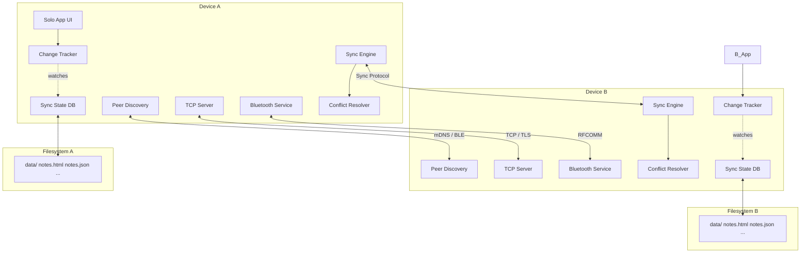
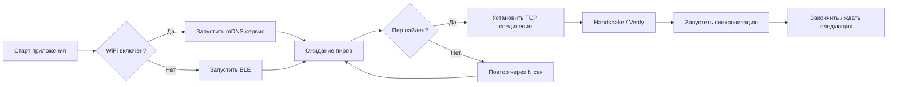
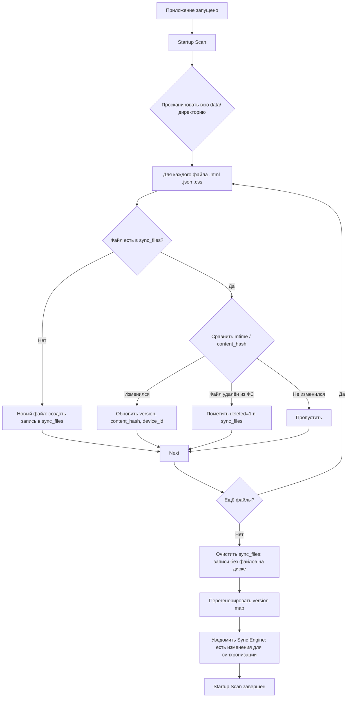
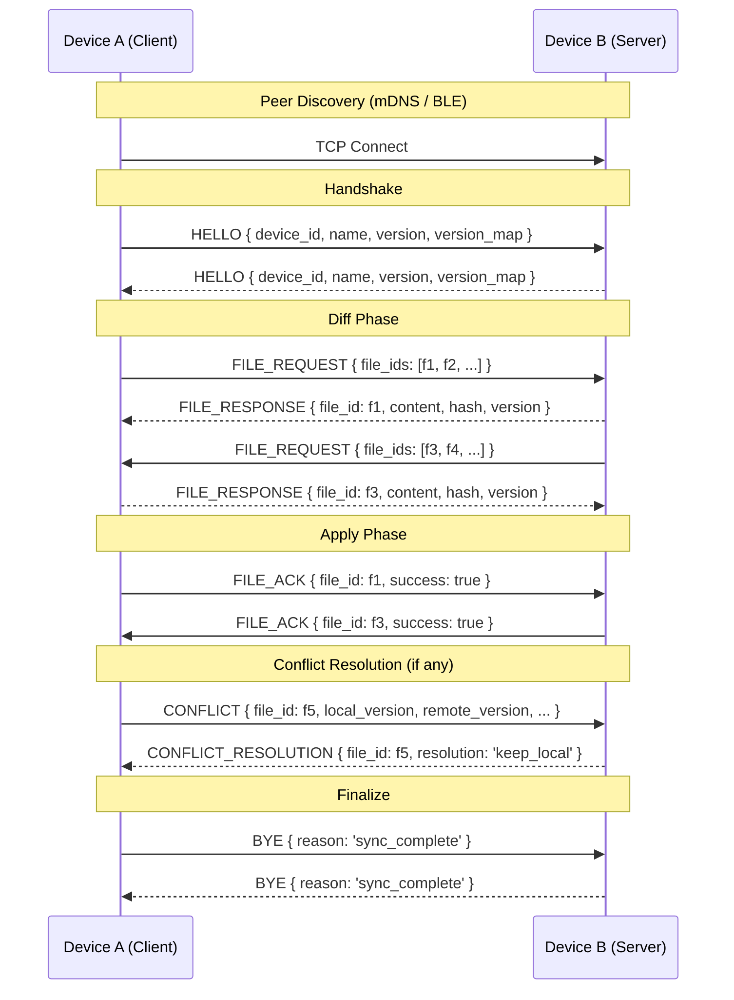
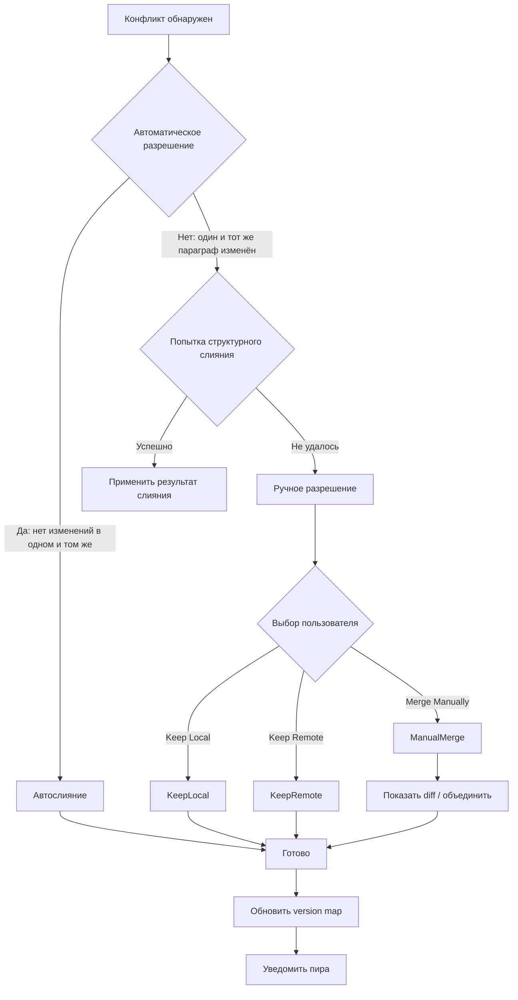
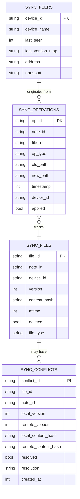

# План P2P-синхронизации для Solo

## 1. Общая архитектура

### 1.1 Цель
Обеспечить бесшовную синхронизацию заметок между устройствами Solo (Android ↔ Desktop, Android ↔ Android, Desktop ↔ Desktop) без центрального сервера, используя WiFi (LAN) как основной транспорт и Bluetooth как резервный.

### 1.2 Принципы
- **Peer-to-Peer (Mesh)**: Нет центрального сервера. Все устройства равноправны.
- **Offline-first**: Каждое устройство работает автономно, синхронизация происходит при обнаружении пира.
- **Без регистрации**: Идентификация по локальному Device ID (генерируется при первом запуске).
- **File-based sync**: Источник истины — файлы на диске (`.html`, `.json`, `.css`).
- **Content-level merge**: Конфликты разрешаются на уровне параграфов/полей, а не целых файлов.

### 1.3 Компоненты системы



### 1.4 Слои абстракции

| Слой | Компонент | Ответственность |
|------|-----------|----------------|
| **Transport** | `TCP Server/Client`, `Bluetooth Service` | Передача данных между устройствами |
| **Discovery** | `PeerDiscovery` (mDNS + BLE) | Обнаружение других устройств Solo в сети/рядом |
| **Persistence** | `SyncStateDB` | Хранение версий, хэшей, состояния синхронизации |
| **Change Tracking** | `ChangeTracker` + `FileWatcher` | Отслеживание локальных изменений файлов |
| **Sync Protocol** | `SyncEngine` | Обмен version map, запрос/передача файлов |
| **Conflict Resolution** | `ConflictResolver` | Обнаружение и разрешение конфликтов |
| **UI Layer** | `SyncSettings`, `SyncStatus`, `ConflictDialog` | Интерфейс пользователя |

---

## 2. Peer Discovery (Обнаружение устройств)

### 2.1 WiFi (основной) — mDNS/DNS-SD

- **Сервис**: `_solo-p2p._tcp.local`
- **Порт**: динамический (конфигурируемый, по умолчанию 54879)
- **TXT Records**:
  - `device_id` — уникальный ID устройства
  - `device_name` — имя устройства (пользовательское)
  - `version` — версия протокола
  - `port` — TCP порт для синхронизации

**Desktop (Electron):**
- Пакет: [`multicast-dns`](https://www.npmjs.com/package/multicast-dns)
- Или нативный модуль через `dns-sd` (Apple Bonjour)
- Процесс: стартует при запуске приложения, публикует сервис

**Android:**
- `NsdManager` (Network Service Discovery) — нативный API для mDNS
- Регистрация сервиса через `NsdManager.registerService()`
- Поиск через `NsdManager.discoverServices()`

### 2.2 Bluetooth (резервный) — BLE + RFCOMM

- **BLE Advertising**: устройство рекламирует себя с `device_id` и service UUID `0000SOLO-...`
- **BLE Scanning**: сканирование устройств поблизости
- После обнаружения — соединение по **RFCOMM** (классический Bluetooth) для передачи данных, так как BLE слишком медленный для передачи файлов

**Desktop (Electron) — Linux / Ubuntu:**
- Linux использует стек **BlueZ** — стандартный Bluetooth-стек для GNU/Linux
- Варианты реализации в Electron:
  1. **`bluetooth-serial-port`** (npm) — Node.js binding для RFCOMM через BlueZ. Позволяет открывать последовательный порт Bluetooth и передавать данные.
  2. **`noble`** (npm) — BLE central/peripheral, работает через D-Bus с BlueZ. Подходит для обнаружения (advertising/scanning).
  3. **`node-bluetooth`** (npm) — обёртка над BlueZ для RFCOMM, device discovery, pairing.
  4. **Прямые вызовы D-Bus** через `dbus` (npm) — самый низкоуровневый и гибкий вариант, но требует больше кода.
- На Ubuntu пакеты: `sudo apt install bluez bluez-tools libbluetooth-dev`
- Electron main process запускает нативный Bluetooth через `child_process` + `bluetoothctl` или через Node.js модули, перечисленные выше.
- Web Bluetooth API (`navigator.bluetooth`) в Electron **не используется** — он доступен только в renderer process и не даёт доступа к RFCOMM.

**Desktop (Electron) — macOS:**
- CoreBluetooth через `noble` или нативные Swift bindings.

**Desktop (Electron) — Windows:**
- WinRT Bluetooth API через `noble` (Windows 10+ поддерживает BLE).

**Android:**
- `BluetoothLeScanner` + `BluetoothAdapter` для BLE.
- `BluetoothDevice.createRfcommSocketToServiceRecord()` для RFCOMM соединения.
- `BluetoothServerSocket` для приёма соединений.

**Важно:** Bluetooth на десктопе — **опциональная** функция. Если Bluetooth чип отсутствует или драйверы не установлены, приложение продолжает работать только через WiFi.

### 2.3 Стратегия обнаружения



- **WiFi+Bluetooth одновременно**: Если WiFi доступен, используем mDNS. Bluetooth включаем как fallback.
- **Ручное добавление**: Пользователь может ввести IP:порт другого устройства вручную.
- **Периодический поиск**: Каждые 30 секунд (или по запросу пользователя).

---

## 3. Транспортный слой

### 3.1 WiFi (TCP)

- **Роль**: Каждое устройство — одновременно сервер и клиент.
- **Протокол**: TCP сокеты, поверх — JSON-line протокол (каждое сообщение — JSON с `\n`).
- **Порт**: По умолчанию `54879`, проверка занятости, автоинкремент.
- **TLS**: Опционально, с самоподписанными сертификатами (PIN-верификация).

**Desktop (Electron):**
- Node.js `net` module для TCP сервера/клиента.
- `tls` module для шифрования.

**Android:**
- `java.net.ServerSocket` / `Socket` в фоновом сервисе (`ForegroundService` для Android 14+).
- `SSLSocket` для шифрования.

### 3.2 Bluetooth (RFCOMM)

- Используется, когда WiFi недоступен.
- Скорость: ~2-3 Мбит/с (BT 4.0+) — достаточно для заметок (текст, мелкие изображения).
- **Desktop**: Поддержка Bluetooth на десктопах опциональна (не все имеют BT). При отсутствии — только WiFi.
- **Linux/Ubuntu**: RFCOMM через `/dev/rfcomm*` устройства или через `bluetooth-serial-port` Node.js модуль.
- **Android**: `BluetoothSocket` с UUID сервиса для RFCOMM.

**Проверка доступности Bluetooth на старте (Desktop):**
```typescript
async function isBluetoothAvailable(): Promise<boolean> {
  try {
    // Linux: проверка через hcitool или DBus
    const result = await exec('hcitool dev');
    return result.stdout.includes('hci');
  } catch {
    return false;
  }
}
```

Если Bluetooth недоступен — транспортный менеджер использует только WiFi.

### 3.3 Message Format

```typescript
interface SyncMessage {
  type: MessageType;
  senderId: string;
  targetId?: string;     // для directed messages
  sequenceId: string;    // уникальный ID сообщения (UUID)
  timestamp: number;     // unix ms
  payload: any;
}

enum MessageType {
  HELLO = 'hello',
  VERSION_MAP_REQUEST = 'version_map_request',
  VERSION_MAP_RESPONSE = 'version_map_response',
  FILE_REQUEST = 'file_request',
  FILE_RESPONSE = 'file_response',
  FILE_ACK = 'file_ack',
  CONFLICT = 'conflict',
  CONFLICT_RESOLUTION = 'conflict_resolution',
  BYE = 'bye',
  PING = 'ping',
  PONG = 'pong',
}
```

---

## 4. Change Tracker (Отслеживание изменений)

### 4.1 Как отслеживаем изменения

**Desktop (Electron):**
- `fs.watch` (или `chokidar`) на директории данных.
- События: `add`, `change`, `unlink` для `.html`, `.json`, `.css` файлов.

**Android:**
- `FileObserver` для мониторинга директории.
- Или периодическая проверка (polling) раз в 5 секунд (менее эффективно, но надёжнее).

### 4.2 Sync State Database

Локальная БД (SQLite на Electron, Room на Android) для отслеживания состояния каждого файла.

```sql
-- Версия каждого файла
CREATE TABLE sync_files (
  file_id TEXT PRIMARY KEY,          -- относительный путь файла
  note_id TEXT,                      -- metadata.id
  device_id TEXT NOT NULL,           -- последний модифицировавший device_id
  version INTEGER NOT NULL,          -- монотонный счётчик версий
  content_hash TEXT NOT NULL,        -- SHA-256 содержимого
  mtime INTEGER NOT NULL,            -- unix ms последней модификации
  deleted INTEGER DEFAULT 0,         -- soft delete
  file_type TEXT NOT NULL            -- 'html' | 'json' | 'css'
);

-- Известные пиры и их последняя известная version map
CREATE TABLE sync_peers (
  device_id TEXT PRIMARY KEY,
  device_name TEXT,
  last_seen INTEGER,                 -- unix ms
  last_version_map TEXT,             -- JSON: { file_id: version }
  address TEXT,                      -- IP:port
  transport TEXT                     -- 'wifi' | 'bluetooth'
);

-- Лог операций (для репликации и отмены)
CREATE TABLE sync_operations (
  op_id TEXT PRIMARY KEY,            -- UUID
  note_id TEXT,
  file_id TEXT,
  op_type TEXT NOT NULL,             -- 'create' | 'update' | 'delete' | 'rename'
  old_path TEXT,
  new_path TEXT,
  timestamp INTEGER NOT NULL,
  device_id TEXT NOT NULL,
  applied INTEGER DEFAULT 0
);
```

### 4.3 Startup Scan (обнаружение изменений после незапуска приложения)

**Проблема:** Пользователь удалил/переименовал/изменил файлы заметок напрямую в файловой системе (через файловый менеджер, синхронизацию с облаком, Git и т.д.), пока приложение Solo было не запущено. Change Tracker в реальном времени не работал, и Sync State DB не обновлялась.

**Решение — Startup Scan:**



**Детали Startup Scan:**

1. При запуске приложения (после инициализации `NotesStore.loadFromStorage()`) запускается полный скан директории данных.
2. Для каждого файла сравнивается:
   - `mtime` из файловой системы vs `mtime` в `sync_files` — если отличается, пересчитываем `content_hash`.
   - Если `content_hash` не совпадает — файл был изменён в обход приложения, обновляем версию.
3. Для каждого файла из `sync_files`, которого нет на диске:
   - Если `deleted=0` — значит файл был удалён внешне. Ставим `deleted=1`.
   - Это сгенерирует событие для sync engine: "файл удалён".
4. Новые файлы (есть на диске, нет в `sync_files`) — добавляются как новые записи.
5. Startup Scan логируется в `sync_operations` как специальная операция с типом `'startup_scan'`.

**Влияние на синхронизацию:**
- Если файл был удалён на устройстве A (через ФС), а на устройстве B — изменён, то при первой же синхронизации после Startup Scan это будет обнаружено как конфликт (как описано в секции 6.7).
- Если файл был изменён на обоих устройствах независимо — стандартный механизм конфликтов.

**Производительность Startup Scan:**
- Для типичной базы в ~1000 заметок и ~3000 файлов скан занимает <1 секунды (чтение метаданных файлов).
- Вычисление SHA-256 для каждого файла при скане: читаем только несколько первых байт и сравниваем с сохранённым хэшем. Если хэш совпадает — полное чтение не нужно. Полное чтение только для изменившихся файлов.

### 4.4 Жизненный цикл версии

```
1. Пользователь изменяет заметку
2. ChangeTracker получает событие файла
3. Вычисляется SHA-256 содержимого
4. Если хэш изменился:
   a. version = max(local_version, known_peers_version) + 1
   b. device_id = local device_id
   c. content_hash = SHA-256
   d. sync_files обновляется
   e. sync_operations добавляется запись
5. Sync Engine уведомляется: "есть изменения"
```

### 4.5 Версионирование

```typescript
interface VersionInfo {
  fileId: string;
  noteId: string;
  deviceId: string;
  version: number;
  contentHash: string;
  mtime: number;
  deleted: boolean;
}

interface VersionMap {
  entries: Record<string, VersionInfo>;  // file_id -> VersionInfo
  deviceId: string;
  timestamp: number;
}
```

---

## 5. Протокол синхронизации

### 5.1 Полный цикл синхронизации



### 5.2 Детальный алгоритм

**1. Handshake**

```typescript
interface HelloPayload {
  deviceId: string;
  deviceName: string;
  protocolVersion: string;    // "1.0.0"
  versionMap: VersionMap;
  capabilities: {             // какие транспорты/фичи поддерживаются
    bluetooth: boolean;
    tls: boolean;
    conflictMerge: boolean;
  };
}
```

**2. Diff (каждый пир вычисляет независимо)**

Для каждого файла из version map пира:
- Если `file_id` отсутствует локально → нужно скачать
- Если `file_id` есть, но `version` выше на удалённом → нужно скачать
- Если `file_id` есть, `version` выше локально → нужно отдать
- Если `version` одинаковый, но `content_hash` разный → **конфликт**
- Если `version` отличается на обоих устройствах независимо (concurrent updates) → **конфликт**

**3. Transfer**

Запрашиваются/передаются только файлы, которые отличаются. Основание: версия или (при конфликте) обе версии.

**4. Apply**

- Новые файлы создаются на диске.
- Обновлённые файлы перезаписываются (с бекапом старой версии в `.backup`).
- Удалённые файлы (soft delete с `deleted=1`) удаляются с диска.
- Sync state БД обновляется.

**5. Finalize**

- Обмен финальными ACK.
- Если остались конфликты — сохранить в `sync_conflicts` и уведомить пользователя.

---

## 6. Механизм разрешения конфликтов

### 6.1 Уровни разрешения



### 6.2 Автоматическое разрешение (Level 1)

**Правила:**
1. **Высшая версия побеждает** — если одна версия строго новее (version больше), она принимается.
2. **Разные файлы** — изменения в разных файлах (например, `note1.html` и `note2.html`) не конфликтуют, применяются оба.
3. **Один и тот же файл, непересекающиеся изменения** — если в HTML-файле изменены разные параграфы или разные поля JSON.
4. **`device_id` как tiebreaker** — при одинаковых версиях/времени, device_id с меньшим значением лексикографически считается "победителем".

### 6.3 Структурное слияние (Level 2) — для HTML

**HTML-документ разбивается на элементы с `data-id`:**
```html
<p data-id="uuid-1">Первый параграф</p>
<p data-id="uuid-2">Второй параграф</p>
```

- Каждый параграф при создании получает уникальный `data-id`.
- При слиянии сравниваются параграфы по `data-id`:
  - Параграф, изменённый только на одном устройстве → применяется новая версия.
  - Параграф, изменённый на обоих устройствах → LWW по timestamp + device_id.
  - Параграф, удалённый на одном и изменённый на другом → удаление побеждает (или наоборот, конфигурируемо).
- Заголовки (`h1-h6`) имеют собственные `data-id`.
- Метаданные (теги, тема) хранятся в JSON → мерж на уровне полей.

### 6.4 Структурное слияние — для JSON (metadata)

Метаданные заметки (в `.json`):
```json
{
  "id": "12345",
  "tags": ["notes", "personal"],
  "createdAt": "2025-01-01",
  "theme": "air",
  "paragraphTags": ["poem"]
}
```

**Правила слияния:**
- `id`, `createdAt` — не изменяются, берутся из любой версии.
- `tags` — объединение массивов (union).
- `paragraphTags` — объединение массивов.
- `theme` — LWW (последняя запись побеждает).

### 6.5 Ручное разрешение (Level 3)

- **UI**: Модальное окно с выбором:
  - "Оставить локальную версию"
  - "Принять удалённую версию"
  - "Посмотреть diff и объединить вручную"
- **Diff view**: Показывается два варианта содержимого (или визуальное сравнение).
- **Notifications**: Toast/notification в приложении о наличии конфликтов.
- **Хранение**: Конфликт резолвится не сразу — обе версии сохраняются, файл помечается как конфликтный.

### 6.6 Операции переименования

Переименование заметки = rename файла + update metadata.

- `sync_operations` хранит `old_path` и `new_path`.
- При синхронизации операции переименования реплицируются.
- Конфликт переименования: если обе стороны переименовали один файл в разные имена → создаются оба файла, пользователь решает.

### 6.7 Удаление

- Deleting a note creates a soft-delete marker (deleted=1) + `sync_operations` запись.
- При синхронизации: если на устройстве A заметка удалена, а на B — изменена → конфликт.
- Разрешение: пользователь выбирает (но по умолчанию — удаление имеет приоритет, так как это явное действие).

---

## 7. Интеграция с существующей архитектурой Solo

### 7.1 Новые зависимости

**Desktop (Electron):**
- `better-sqlite3` — уже используется, будем использовать для Sync State DB
- `multicast-dns` — mDNS discovery
- `chokidar` — более надёжный file watcher (опционально, можно `fs.watch`)
- `crypto` (built-in) — SHA-256 хэши

**Android:**
- Room / SQLite — sync state DB
- Bluetooth + BLE нативные API
- NsdManager — mDNS

**Shared (TypeScript — рендерер Electron + возможный shared слой):**
- Библиотека для протокола синхронизации (можно вынести в shared package)

### 7.2 Новые файлы/компоненты

```
solo/
  src/
    sync/                              # Новый модуль синхронизации
      SyncEngine.ts                    # Основной движок
      SyncStateDB.ts                   # Работа с Sync State БД
      ChangeTracker.ts                 # Отслеживание изменений
      ConflictResolver.ts              # Разрешение конфликтов
      PeerDiscovery.ts                 # Обнаружение пиров (mDNS)
      TransportManager.ts              # Управление транспортами
      Protocol.ts                      # Сообщения протокола
      types.ts                         # Типы синхронизации
      utils.ts                         # Хэширование, утилиты
    components/
      Sync/
        SyncSettings.tsx               # Настройки синхронизации
        SyncStatus.tsx                 # Статус соединения
        SyncPeerList.tsx               # Список устройств
        ConflictDialog.tsx             # Диалог разрешения конфликтов
    stores/
      SyncStore.ts                     # MobX store для синхронизации
  native-clients/
    electron/
      electron/
        sync/
          ElectronSyncTransport.ts     # TCP сервер/клиент для Electron
          ElectronFileWatcher.ts       # File watcher для Electron
          ElectronSyncStateDB.ts       # SQLite sync state
    android/
      app/src/main/java/com/solo/app/sync/
        AndroidSyncTransport.kt        # TCP + Bluetooth для Android
        AndroidFileWatcher.kt          # FileObserver
        AndroidSyncStateDB.kt          # Room sync state
        PeerDiscoveryService.kt        # mDNS + BLE
        BluetoothSyncService.kt        # Bluetooth sync service
```

### 7.3 Настройки синхронизации (UI)

В `SettingsModal` добавляется секция "Synchronization":
- Включить/выключить синхронизацию
- Имя устройства (peer name)
- Выбор транспортов (WiFi / Bluetooth)
- Список обнаруженных устройств
- Ручное добавление устройства (IP:port)
- Статус последней синхронизации
- Список конфликтов

### 7.4 Sync Store (MobX)

```typescript
class SyncStore {
  enabled: boolean;
  deviceName: string;
  transportMode: TransportMode;  // 'wifi' | 'bluetooth' | 'both'
  discoveredPeers: PeerInfo[];
  connectedPeers: PeerInfo[];
  syncStatus: SyncStatus;         // 'idle' | 'scanning' | 'syncing' | 'error'
  pendingConflicts: ConflictInfo[];
  lastSyncTime: number | null;
  
  // Actions
  toggleSync(): void;
  manualSync(): void;
  addPeerByAddress(ip: string, port: number): void;
  resolveConflict(conflictId: string, resolution: Resolution): void;
}
```

---

## 8. Обработка особых случаев

### 8.1 Одновременные изменения на 3+ устройствах

- Версионирование на основе Dotted Version Vectors (DVV).
- Каждое устройство ведёт свой счётчик, версия = `{ deviceA: 5, deviceB: 3 }`.
- Конфликт = когда версии concurrent (ни одна не dominates другую).

Упрощённый подход: в Solo используется монотонный глобальный счётчик, но при конфликте concurrent записей — структурное слияние + user resolution.

### 8.2 Прерывание соединения

- Частично переданные файлы игнорируются (проверка content_hash).
- При переподключении — повторный diff (только файлы, не успевшие подтвердиться).
- Resume: если передача большого файла прервана, начинаем заново (для заметок это не проблема — они маленькие).

### 8.3 Шифрование данных

- **TLS** для WiFi (самоподписанные сертификаты, PIN-верификация первого соединения).
- **Bluetooth**: шифрование на уровне RFCOMM (канал зашифрован, если оба устройства поддерживают).
- Данные на диске **не шифруются** (Solo и так хранит всё в открытом виде — это осознанное решение).

### 8.4 Производительность

- **Batch transfers**: файлы группируются и передаются пачками.
- **Debounce**: ChangeTracker использует debounce (1-2 секунды) для группировки изменений.
- **Throttle**: не более N запросов в секунду к пиру.
- **Priority**: сначала синхронизируются метаданные (маленькие .json), потом .html, потом .css.

---

## 9. Этапы реализации

| Этап | Описание | Компоненты |
|------|----------|------------|
| **1. Sync State DB** | Создать таблицы, миграции, CRUD операции | `SyncStateDB.ts`, `sync/types.ts` |
| **2. Change Tracker** | File watcher, вычисление хэшей, обновление sync state | `ChangeTracker.ts`, file watchers под платформу |
| **3. Peer Discovery** | mDNS сервис, BLE сканирование, ручное добавление | `PeerDiscovery.ts`, `PeerDiscoveryService.kt` |
| **4. Transport** | TCP сервер/клиент, Bluetooth RFCOMM, Message Protocol | `TransportManager.ts`, `ElectronSyncTransport.ts`, `AndroidSyncTransport.kt` |
| **5. Sync Engine** | Handshake, diff, transfer, apply, version maps | `SyncEngine.ts`, `Protocol.ts` |
| **6. Conflict Resolution** | Автоматическое слияние (HTML/JSON), UI для ручного | `ConflictResolver.ts`, `ConflictDialog.tsx` |
| **7. UI** | Настройки, статус, список пиров, конфликты | `SyncSettings.tsx`, `SyncStatus.tsx`, `SyncPeerList.tsx`, `SyncStore.ts` |
| **8. Интеграция и тесты** | End-to-end тесты на двух устройствах, edge cases | — |

### Приоритет: Этапы 1-4 (core инфраструктура) → 5 (sync engine) → 6 (conflict resolution) → 7 (UI).

---

## 10. Модель данных для синхронизации (диаграмма)


