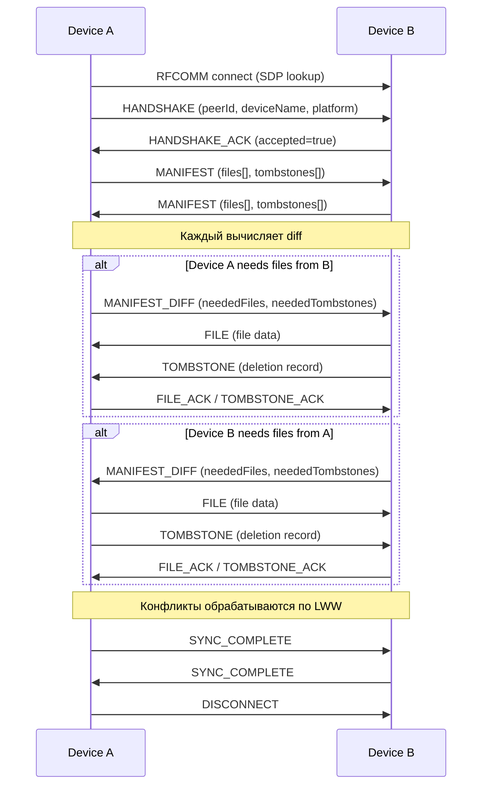
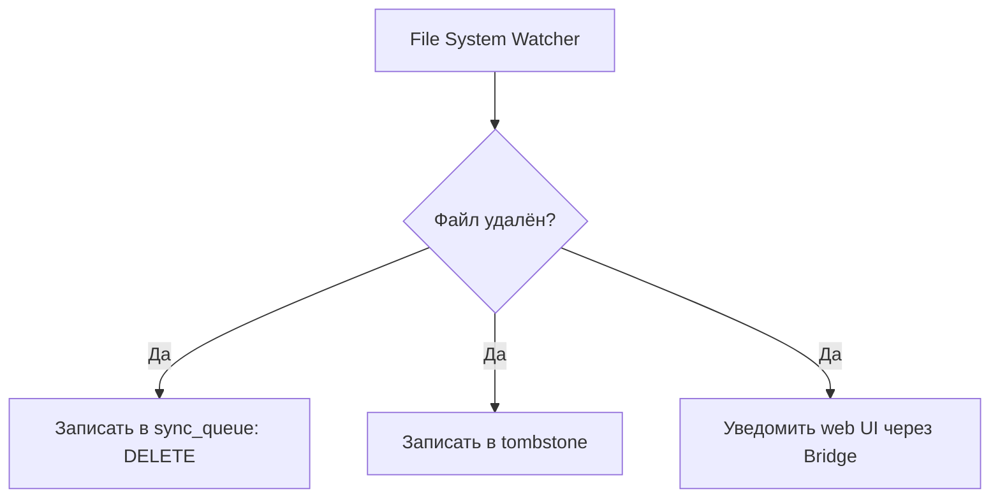
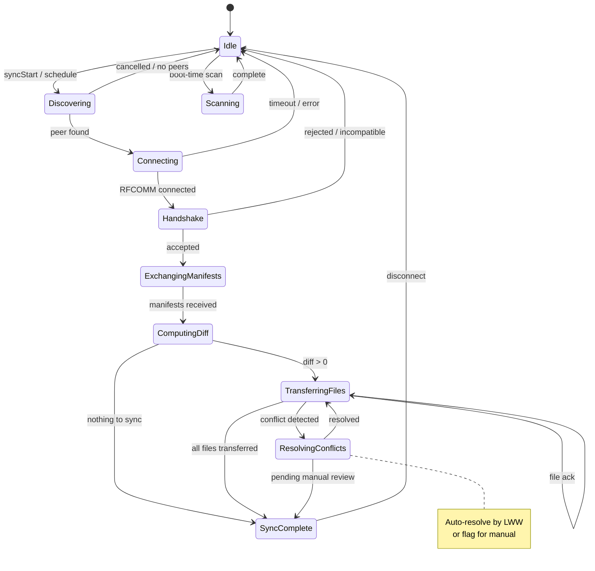

# P2P Bluetooth-синхронизация для Solo

## 1. Выбор подхода: Web Bluetooth API vs Native Bridge

### Web Bluetooth API ❌ — не подходит

| Критерий | Web Bluetooth API | Почему не подходит |
|----------|------------------|-------------------|
| Доступность в Android WebView | ❌ Не поддерживается | WebView не имеет доступа к Web Bluetooth API |
| P2P-соединение устройство-устройство | ❌ Только browser-to-peripheral | API спроектировано для подключения браузера к BLE-периферии (датчики, наушники), а не для P2P |
| BLE MTU | ~20-512 байт | Непригодно для передачи файлов заметок |
| Background-режим | ❌ | При свёрнутом приложении соединение теряется |
| Обнаружение устройств | ❌ Только по GATT service UUID | Нет нормального peer discovery |
| Electron (Ubuntu/Mac) | ⚠️ Частично | Работает только в Chromium, но не даёт P2P |
| Несколько подключений | ❌ | Ограничения на количество одновременных подключений |

### Native Bridge ✅ — рекомендуемый подход

| Платформа | Технология | Возможности |
|-----------|-----------|-------------|
| **Android** | Android Bluetooth API + `BluetoothAdapter` | RFCOMM, BLE, FileObserver, foreground service |
| **Ubuntu (Linux)** | BlueZ через D-Bus | RFCOMM, SDP, `inotify` для file watching |
| **macOS** | CoreBluetooth / IOBluetooth | RFCOMM (через IOBluetoothRFCOMMChannel) или BLE |
| **Electron** | Node.js native addon или child_process к системному Bluetooth stack | BlueZ на Linux, IOBluetooth на Mac |

**Вывод**: Native Bridge — единственный viable вариант. Весь Bluetooth-код будет жить на стороне нативных клиентов (Electron main process, Android Kotlin), а веб-слой получает абстрактное API через существующий Bridge.

---

## 2. Высокоуровневая архитектура

```
┌──────────────────────────────────────────────────┐
│               Web Layer (UI)                     │
│  ┌──────────────────────────────────────────┐   │
│  │          SyncManager (TypeScript)         │   │
│  │  - startSync() / stopSync()              │   │
│  │  - getSyncStatus()                       │   │
│  │  - onSyncEvent(callback)                 │   │
│  │  - resolveConflict(fileId, strategy)     │   │
│  └──────────────────┬───────────────────────┘   │
│                     │ Bridge (IPC/JSInterface)   │
├─────────────────────▼───────────────────────────┤
│             Native Sync Layer                    │
│                                                   │
│  ┌─────────────────┐  ┌──────────────────────┐  │
│  │   SyncEngine     │  │  BluetoothManager    │  │
│  │   (native)       │  │  (platform impl)     │  │
│  │                   │  │                      │  │
│  │  - sync sessions  │  │  - discovery         │  │
│  │  - diff compute   │  │  - connect           │  │
│  │  - conflict res.  │  │  - send/receive      │  │
│  │  - file watching  │  │  - RFCOMM sockets    │  │
│  │  - boot-time scan │  │                      │  │
│  └────────┬──────────┘  └──────────┬───────────┘  │
│           │                        │               │
│  ┌────────▼────────────────────────▼───────────┐  │
│  │              SQLite DB                      │  │
│  │  - sync_ledger (версии файлов)              │  │
│  │  - sync_peers (доверенные устройства)        │  │
│  │  - sync_queue (очередь исходящих изменений)  │  │
│  │  - tombstone (удалённые файлы)              │  │
│  │  - sync_conflicts (конфликты)               │  │
│  └─────────────────────────────────────────────┘  │
└───────────────────────────────────────────────────┘
```

### 2.1 Принцип интеграции с существующим Bridge

Новые IPC-каналы (Electron) / @JavascriptInterface методы (Android):

```typescript
// Расширение ElectronAPI в preload.ts
interface SyncBridge {
  // Управление синхронизацией
  syncStart(): Promise<{ success: boolean }>;
  syncStop(): Promise<{ success: boolean }>;
  syncGetStatus(): Promise<SyncStatus>;
  
  // Пиры
  syncDiscoverPeers(): Promise<PeerDevice[]>;
  syncPairDevice(deviceId: string): Promise<{ success: boolean }>;
  syncUnpairDevice(deviceId: string): Promise<{ success: boolean }>;
  syncGetPeers(): Promise<PeerDevice[]>;
  
  // Конфликты
  syncGetConflicts(): Promise<SyncConflict[]>;
  syncResolveConflict(conflictId: string, strategy: 'local' | 'remote' | 'merge'): Promise<{ success: boolean }>;
  
  // События (через callback/event listener)
  onSyncEvent(callback: (event: SyncEvent) => void): () => void;
}

// Расширение AndroidBridgeRaw
interface AndroidBridgeRaw {
  // ... существующие методы
  syncStart(): string;  // JSON response
  syncStop(): string;
  syncGetStatus(): string;
  syncDiscoverPeers(): string;
  syncPairDevice(deviceId: string): string;
  syncUnpairDevice(deviceId: string): string;
  syncGetPeers(): string;
  syncGetConflicts(): string;
  syncResolveConflict(conflictId: string, strategy: string): string;
}
```

---

## 3. Протокол синхронизации

### 3.1 Транспортный уровень

**Bluetooth Classic (RFCOMM)** — основной транспорт, так как:
- Надёжная передача потока данных (аналог TCP)
- Достаточная пропускная способность для HTML-файлов
- Поддерживается на всех трёх платформах

**BLE (Bluetooth Low Energy)** — для discovery и handshake, если RFCOMM discovery медленный.

**Service UUID**: `xxxxxxxx-xxxx-xxxx-xxxx-xxxxxxxxxxxx` (кастомный UUID для сервиса Solo Sync)

### 3.2 Формат сообщений

Бинарный протокол поверх RFCOMM:

```
┌─────────────────────────────────────────────────────┐
│ Byte 0: Message Type (1 byte)                       │
│ Byte 1-4: Payload Length (4 bytes, big-endian)      │
│ Byte 5+: Payload (JSON or binary)                   │
└─────────────────────────────────────────────────────┘
```

**Типы сообщений**:

| Type | Название | Payload | Описание |
|------|----------|---------|----------|
| 0x01 | HANDSHAKE | `{ peerId, deviceName, platform, appVersion, protocolVersion }` | Начало сессии |
| 0x02 | HANDSHAKE_ACK | `{ peerId, accepted, rejectReason? }` | Подтверждение |
| 0x03 | MANIFEST | `{ files: [{ fileId, version, checksum, modifiedAt }], tombstones: [{ fileId, deletedAt }] }` | Список файлов и их версий |
| 0x04 | MANIFEST_DIFF | `{ neededFiles: [fileId], neededTombstones: [fileId] }` | Запрос недостающих файлов |
| 0x05 | FILE | `{ fileId, version, path, content, metadata, checksum }` | Передача файла |
| 0x06 | FILE_ACK | `{ fileId, version, accepted, conflict? }` | Подтверждение получения |
| 0x07 | TOMBSTONE | `{ fileId, deletedAt, originalPath }` | Уведомление об удалении |
| 0x08 | TOMBSTONE_ACK | `{ fileId, accepted }` | Подтверждение удаления |
| 0x09 | SYNC_COMPLETE | `{ summary }` | Завершение сессии |
| 0x0A | DISCONNECT | `{ reason }` | Отключение |
| 0x0B | CONFLICT_RESOLUTION | `{ fileId, strategy, resolvedVersion }` | Разрешение конфликта |
| 0xFE | PING | — | Keepalive |
| 0xFF | ERROR | `{ code, message }` | Ошибка |

### 3.3 Последовательность синхронизации



---

## 4. Peer Discovery

### 4.1 Механизм обнаружения

На каждой платформе используется нативный Bluetooth discovery:

| Платформа | API | Примечание |
|-----------|-----|------------|
| **Android** | `BluetoothAdapter.startDiscovery()` | Фильтр по UUID сервиса Solo |
| **Linux (Ubuntu)** | BlueZ D-Bus API (`org.bluez.Adapter1.StartDiscovery`) | Фильтр по UUID |
| **macOS** | IOBluetoothDeviceInquiry | Classic Bluetooth discovery |

**Принцип**:
1. Устройство начинает discovery (сканирование)
2. При обнаружении устройства с сервисом Solo Sync, получаем его имя и адрес
3. Инициируем RFCOMM-соединение
4. После HANDSHAKE добавляем устройство в список "известных", если его там нет
5. Для уже известных устройств можно подключаться напрямую (без discovery) по сохранённому MAC-адресу

### 4.2 Хранение информации о пирах (SQLite)

```sql
CREATE TABLE sync_peers (
    id TEXT PRIMARY KEY,                    -- UUID устройства
    name TEXT NOT NULL,                     -- человекочитаемое имя
    device_type TEXT NOT NULL CHECK(device_type IN ('android', 'linux', 'mac', 'electron')),
    mac_address TEXT,                       -- Bluetooth MAC (может меняться на Android 10+)
    last_seen_at INTEGER NOT NULL,          -- unix timestamp ms
    first_seen_at INTEGER NOT NULL,
    trust_status TEXT DEFAULT 'pending' CHECK(trust_status IN ('pending', 'trusted', 'blocked')),
    public_key TEXT,                        -- для будущей криптографии
    protocol_version INTEGER DEFAULT 1,
    is_paired INTEGER DEFAULT 0
);

CREATE INDEX idx_peers_last_seen ON sync_peers(last_seen_at);
CREATE INDEX idx_peers_trust_status ON sync_peers(trust_status);
```

---

## 5. Система разрешения конфликтов

### 5.1 Принцип: Last-Write-Wins (LWW) с флагом для ручного разрешения

Конфликт возникает, когда два устройства изменили один и тот же файл между сессиями синхронизации.

### 5.2 Алгоритм детекции конфликтов

```
Для каждого файла в MANIFEST от удалённого пира:
  1. Ищем файл в локальном sync_ledger по file_id
  2. Если файла нет → конфликта нет (новый файл)
  3. Если версия совпадает → конфликта нет
  4. Если локальная версия > remote версия → локальные изменения новее (remote получит наш файл)
  5. Если remote версия > локальная версия → remote изменения новее
  6. Если обе версии изменились с момента последней синхронизации (fork) → КОНФЛИКТ
     - Записываем в sync_conflicts
     - Применяем LWW: выигрывает файл с более поздним modifiedAt
     - Если modifiedAt совпадает (с точностью до мс) — выигрывает устройство с большим приоритетом
     - Помечаем conflict.resolution = 'auto_resolved'
     - Если включён режим ручного разрешения — помечаем 'pending'
```

### 5.3 Стратегии разрешения

| Стратегия | Описание | Когда использовать |
|-----------|----------|-------------------|
| **LWW** (Last-Write-Wins) | Автоматически по modifiedAt | По умолчанию для всех файлов |
| **Local wins** | Всегда сохранять локальную версию | Пользователь явно выбрал |
| **Remote wins** | Всегда принимать удалённую версию | Пользователь явно выбрал |
| **Manual** | Сохранить обе версии, пометить файл | Для важных заметок |

### 5.4 Таблица sync_conflicts

```sql
CREATE TABLE sync_conflicts (
    id INTEGER PRIMARY KEY AUTOINCREMENT,
    file_id TEXT NOT NULL,
    file_path TEXT,
    local_version INTEGER NOT NULL,
    remote_version INTEGER NOT NULL,
    local_checksum TEXT,
    remote_checksum TEXT,
    local_modified_at INTEGER NOT NULL,
    remote_modified_at INTEGER NOT NULL,
    local_content TEXT,          -- сохранённая копия локальной версии
    remote_content TEXT,         -- сохранённая копия удалённой версии
    resolution TEXT DEFAULT 'pending' CHECK(resolution IN ('pending', 'auto_resolved', 'manual')),
    resolved_at INTEGER,
    resolved_by TEXT CHECK(resolved_by IN ('lww', 'local_wins', 'remote_wins', 'manual_merge')),
    created_at INTEGER NOT NULL DEFAULT (unixepoch('now') * 1000)
);
```

### 5.5 Визуализация для пользователя

Через Bridge веб-слой получает список конфликтов и отображает их в UI:

```typescript
interface SyncConflict {
  conflictId: string;
  fileId: string;
  filePath: string;
  localVersion: number;
  remoteVersion: number;
  localModifiedAt: number;
  remoteModifiedAt: number;
  resolution: 'pending' | 'auto_resolved' | 'manual';
}
```

Пользователь может:
- Посмотреть оба варианта
- Выбрать "использовать локальный"
- Выбрать "использовать удалённый"
- (в будущем) смержить вручную

---

## 6. Обработка удаления файлов при выключенном приложении

### 6.1 Проблема

Пользователь может удалить файлы заметок через файловую систему (Finder, File Manager, CLI) в тот момент, когда приложение Solo не запущено. При следующем запуске нужно:
1. Обнаружить, какие файлы были удалены
2. Записать tombstones
3. При следующей синхронизации с пиром — сообщить об удалениях

### 6.2 Решение: три механизма

#### A. File System Watcher (активный, пока приложение работает)



- **Electron**: `fs.watch` или `chokidar` на `dataFolder`
- **Android**: `FileObserver` в foreground service
- **Ubuntu (native)**: `inotify`

#### B. Boot-time Scan (при запуске приложения)

При старте нативного клиента (когда инициализируется main process / Activity):

```
1. Получить список файлов из sync_ledger (SQLite)
2. Проверить существование каждого файла на диске
3. Для каждого отсутствующего файла:
   a. Записать в tombstone (если ещё нет)
   b. Записать в sync_queue: DELETE
   c. Обновить sync_ledger
```

#### C. Manifest-сверка (внутри сессии синхронизации)

При синхронизации оба устройства обмениваются `MANIFEST`, который содержит как существующие файлы, так и tombstones. Если у пира есть файл, которого нет у нас (и нет tombstone), мы просим передать его. Если у пира есть tombstone для файла, который у нас есть — мы удаляем локально.

### 6.3 Таблица tombstone

```sql
CREATE TABLE tombstone (
    file_id TEXT PRIMARY KEY,
    deleted_at INTEGER NOT NULL,           -- unix timestamp ms
    original_path TEXT NOT NULL,
    checksum TEXT,                          -- последняя известная контрольная сумма
    synced_to_peers INTEGER DEFAULT 0      -- 0 = не отправлено, 1 = отправлено
);

-- Очистка старых tombstones (например, раз в день)
CREATE INDEX idx_tombstone_deleted_at ON tombstone(deleted_at);
```

**TTL для tombstones**: 30 дней. После этого запись удаляется, и файл считается "не существовавшим".

### 6.4 Поток обработки удалённого файла от пира

```
1. Получен TOMBSTONE от пира
2. Проверить: существует ли локально файл с таким file_id?
3. Если да:
   a. Удалить файл с диска
   b. Удалить запись из sync_ledger
   c. (Опционально) Переместить в корзину
4. Если file_id неизвестен:
   a. Всё равно записать tombstone (чтобы не запросить файл при следующей синхронизации)
5. Отправить TOMBSTONE_ACK
```

---

## 7. SQLite — полная схема

База данных SQLite создаётся на стороне нативного кода при первом запуске:

```sql
-- Включение WAL mode для конкурентного доступа
PRAGMA journal_mode=WAL;
PRAGMA foreign_keys=ON;

-- Версия схемы для миграций
CREATE TABLE schema_version (
    version INTEGER PRIMARY KEY,
    applied_at INTEGER NOT NULL DEFAULT (unixepoch('now') * 1000)
);

-- Пиры (устройства для синхронизации)
CREATE TABLE sync_peers (
    id TEXT PRIMARY KEY,                    -- UUID устройства
    name TEXT NOT NULL,
    device_type TEXT NOT NULL CHECK(device_type IN ('android', 'linux', 'mac', 'electron')),
    mac_address TEXT,
    last_seen_at INTEGER NOT NULL,
    first_seen_at INTEGER NOT NULL,
    trust_status TEXT DEFAULT 'pending' CHECK(trust_status IN ('pending', 'trusted', 'blocked')),
    public_key TEXT,
    protocol_version INTEGER DEFAULT 1,
    is_paired INTEGER DEFAULT 0
);

-- Реестр синхронизации (что, когда, кем было изменено)
CREATE TABLE sync_ledger (
    id INTEGER PRIMARY KEY AUTOINCREMENT,
    file_id TEXT NOT NULL,
    file_path TEXT NOT NULL,
    version INTEGER NOT NULL DEFAULT 1,
    checksum TEXT NOT NULL,                 -- SHA-256 хеш содержимого
    size_bytes INTEGER NOT NULL DEFAULT 0,
    modified_at INTEGER NOT NULL,           -- unix timestamp ms
    modified_by TEXT,                       -- peer ID (null = local)
    operation TEXT NOT NULL CHECK(operation IN ('create', 'update', 'delete')),
    parent_version INTEGER,                 -- версия, от которой произошло изменение (fork detection)
    synced_at INTEGER,
    UNIQUE(file_id, version)
);

CREATE INDEX idx_ledger_file_id ON sync_ledger(file_id);
CREATE INDEX idx_ledger_modified_at ON sync_ledger(modified_at);
CREATE INDEX idx_ledger_synced ON sync_ledger(synced_at);

-- Очередь исходящих изменений (outbox pattern)
CREATE TABLE sync_queue (
    id INTEGER PRIMARY KEY AUTOINCREMENT,
    file_id TEXT NOT NULL,
    file_path TEXT NOT NULL,
    operation TEXT NOT NULL CHECK(operation IN ('create', 'update', 'delete')),
    local_version INTEGER NOT NULL,
    checksum TEXT,
    created_at INTEGER NOT NULL,
    status TEXT DEFAULT 'pending' CHECK(status IN ('pending', 'in_progress', 'failed', 'done')),
    retry_count INTEGER DEFAULT 0,
    last_error TEXT,
    target_peer_id TEXT,
    FOREIGN KEY (target_peer_id) REFERENCES sync_peers(id)
);

CREATE INDEX idx_queue_status ON sync_queue(status);
CREATE INDEX idx_queue_created ON sync_queue(created_at);

-- Tombstones (удалённые файлы)
CREATE TABLE tombstone (
    file_id TEXT PRIMARY KEY,
    deleted_at INTEGER NOT NULL,
    original_path TEXT NOT NULL,
    checksum TEXT,
    synced_to_peers INTEGER DEFAULT 0
);

CREATE INDEX idx_tombstone_deleted_at ON tombstone(deleted_at);

-- Конфликты
CREATE TABLE sync_conflicts (
    id INTEGER PRIMARY KEY AUTOINCREMENT,
    file_id TEXT NOT NULL,
    file_path TEXT,
    local_version INTEGER NOT NULL,
    remote_version INTEGER NOT NULL,
    local_checksum TEXT,
    remote_checksum TEXT,
    local_modified_at INTEGER NOT NULL,
    remote_modified_at INTEGER NOT NULL,
    local_content TEXT,
    remote_content TEXT,
    resolution TEXT DEFAULT 'pending' CHECK(resolution IN ('pending', 'auto_resolved', 'manual')),
    resolved_at INTEGER,
    resolved_by TEXT CHECK(resolved_by IN ('lww', 'local_wins', 'remote_wins', 'manual_merge')),
    created_at INTEGER NOT NULL DEFAULT (unixepoch('now') * 1000)
);

CREATE INDEX idx_conflicts_resolution ON sync_conflicts(resolution);
CREATE INDEX idx_conflicts_file_id ON sync_conflicts(file_id);

-- Настройки синхронизации (ключ-значение)
CREATE TABLE sync_settings (
    key TEXT PRIMARY KEY,
    value TEXT NOT NULL,
    updated_at INTEGER NOT NULL
);
```

### Настройки по умолчанию (в `sync_settings`):

| key | value | Описание |
|-----|-------|----------|
| `sync_enabled` | `true` | Вкл/Выкл синхронизацию |
| `sync_interval_ms` | `300000` | Интервал авто-синхронизации (5 мин) |
| `conflict_strategy` | `lww` | Стратегия по умолчанию |
| `tombstone_ttl_days` | `30` | Время жизни tombstones |
| `auto_accept_pairing` | `false` | Автоматически принимать запросы паринга |
| `device_name` | (hostname) | Имя устройства для отображения |

---

## 8. Компоненты нативных клиентов

### 8.1 Electron (macOS + Ubuntu)

```
electron/
├── main.ts                    # существующий — добавить инициализацию SyncEngine
├── preload.ts                 # расширить новыми IPC-каналами
├── sync/
│   ├── SyncEngine.ts          # основной движок синхронизации
│   ├── BluetoothManager.ts    # управление Bluetooth (через noble или @abandonware/noble)
│   ├── PeerDiscovery.ts       # обнаружение пиров
│   ├── Protocol.ts            # кодирование/декодирование сообщений
│   ├── FileWatcher.ts         # fs.watch для отслеживания изменений
│   ├── BootScanner.ts         # сканирование при запуске
│   └── ConflictResolver.ts    # разрешение конфликтов
└── db/
    └── SyncDatabase.ts        # SQLite через better-sqlite3
```

**Зависимости**: `better-sqlite3`, `@abandonware/noble` (BLE) или `bluetooth-serial-port` (RFCOMM). Для Linux также потребуется `bluez` (устанавливается через систему).

**Bluetooth на Linux**: Использовать Node.js bindings к BlueZ через D-Bus. Библиотека [`node-bluez`](https://github.com/opencollective/node-bluez) или прямой вызов `bluetoothctl` через child_process.

**Bluetooth на macOS**: CoreBluetooth через [`noble`](https://github.com/abandonware/noble) (BLE) или IOBluetooth через [`node-bluetooth-serial-port`](https://github.com/eelcocramer/node-bluetooth-serial-port) (RFCOMM Classic).

### 8.2 Android

```
app/src/main/java/com/solo/app/
├── sync/
│   ├── SyncEngine.kt           # основной движок
│   ├── BluetoothManager.kt     # Android BluetoothAdapter + RFCOMM
│   ├── PeerDiscovery.kt        # BluetoothDiscovery + bonding
│   ├── Protocol.kt             # кодирование/декодирование
│   ├── FileWatcher.kt          # FileObserver
│   ├── BootScanner.kt          # сканирование при запуске
│   ├── ConflictResolver.kt     # разрешение конфликтов
│   └── SyncService.kt          # Android foreground service
├── db/
│   └── SyncDatabase.kt         # SQLite через Room или raw SQLite
└── bridge/
    └── WebViewBridge.kt        # расширить новыми @JavascriptInterface методами
```

**Bluetooth на Android**: Использовать стандартный Android Bluetooth API. RFCOMM через `BluetoothDevice.createRfcommSocketToServiceRecord(uuid)`. Discovery через `BluetoothAdapter.startDiscovery()` с `BluetoothDevice.EXTRA_UUID`.

**Foreground Service**: Для поддержки фоновой синхронизации (даже когда WebView не активен) используется `SyncService` с уведомлением в статус-баре.

### 8.3 Ubuntu (Linux) — native клиент

Если планируется standalone Linux-клиент (не Electron), то:

```
src/
├── sync_engine.rs или sync_engine.c   # движок на Rust/C
├── bluetooth_manager.c                # BlueZ D-Bus
├── db/sync_database.c                 # SQLite via libsqlite3
└── ...
```

Но на данном этапе Ubuntu поддерживается через Electron, так что отдельный native клиент не требуется.

---

## 9. Соображения по безопасности

1. **Pairing**: Перед первой синхронизацией устройства должны быть "спарены". Пользователь подтверждает паринг на обоих устройствах (PIN-код или кнопка "подтвердить").
2. **No encryption on transport**: Bluetooth RFCOMM может использовать built-in Bluetooth encryption при bonding. В будущем можно добавить шифрование поверх (NaCl/libsodium).
3. **Device identity**: Каждое устройство генерирует UUID при первом запуске, который сохраняется в SQLite. MAC-адрес не используется как identity (на Android 10+ MAC рандомизируется).
4. **Trust-on-first-use (TOFU)**: При первом соединении устройство добавляется в `sync_peers` со статусом `pending`. Пользователь должен явно подтвердить доверие.

---

## 10. План имплементации (по шагам)

| № | Шаг | Что сделать | Где |
|---|-----|------------|-----|
| 1 | **SQLite schema** | Создать миграции, таблицы, DAO | Electron + Android |
| 2 | **SyncDatabase** | Абстракция для работы с SQLite (insert/select/update) | Electron + Android |
| 3 | **Protocol** | Реализовать encode/decode сообщений | Electron + Android |
| 4 | **BluetoothManager** | RFCOMM-соединение, discovery, send/receive | Electron + Android |
| 5 | **PeerDiscovery** | Обнаружение устройств, HANDSHAKE | Electron + Android |
| 6 | **SyncEngine** | Основная логика: diff, manifest, sync session | Electron + Android |
| 7 | **ConflictResolver** | Детекция и разрешение конфликтов (LWW) | Electron + Android |
| 8 | **FileWatcher** | fs.watch / FileObserver | Electron + Android |
| 9 | **BootScanner** | Сканирование при старте | Electron + Android |
| 10 | **Bridge API** | Добавить IPC/JSInterface методы | Electron preload + Android WebViewBridge |
| 11 | **Web SyncManager** | UI-контролы, статус, конфликты | Web-слой (TypeScript) |
| 12 | **UI Sync Settings** | Интерфейс: вкл/выкл, список пиров, конфликты | Web-слой (React) |

---

## 11. Диаграмма состояний синхронизации



---

## 12. Заключение

**Рекомендация**: Native Bridge через Bluetooth Classic (RFCOMM) с SQLite для отслеживания состояния синхронизации. Этот подход:
- Работает на всех трёх платформах (Android, macOS, Ubuntu)
- Использует существующий Bridge-паттерн в Solo
- Даёт полный контроль над Bluetooth (discovery, pairing, RFCOMM)
- Позволяет работать в фоне (foreground service на Android, main process в Electron)
- Обеспечивает надёжную передачу данных с детекцией и разрешением конфликтов

Web Bluetooth API не подходит принципиально из-за отсутствия в Android WebView и ограничений BLE для P2P-синхронизации файлов.
