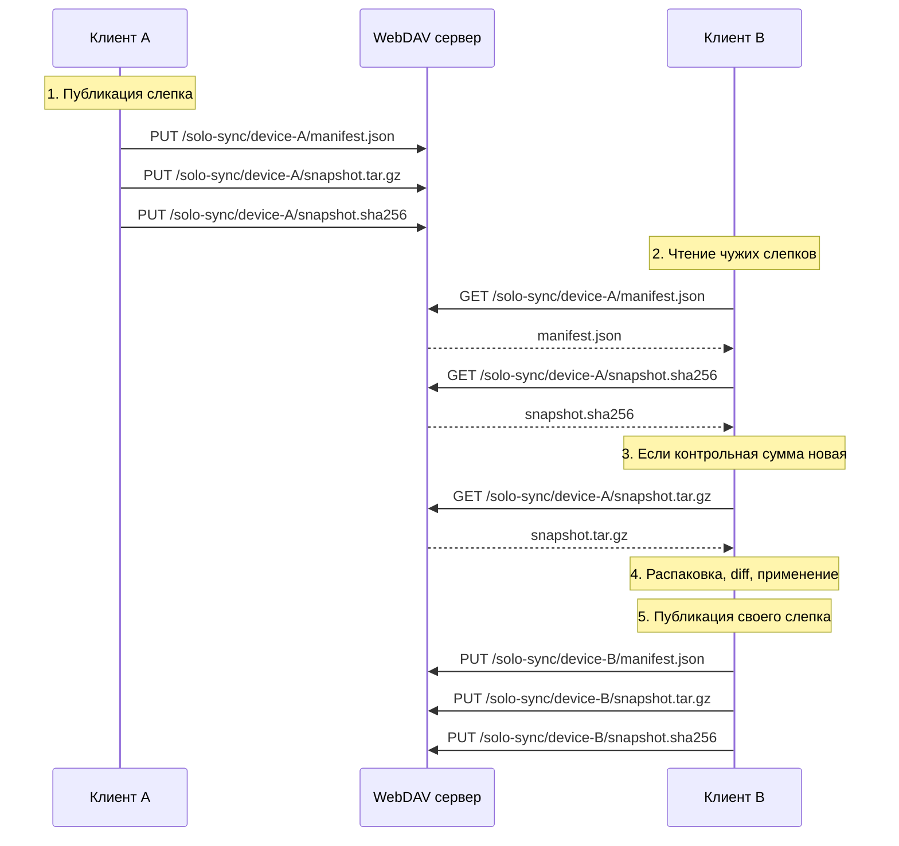
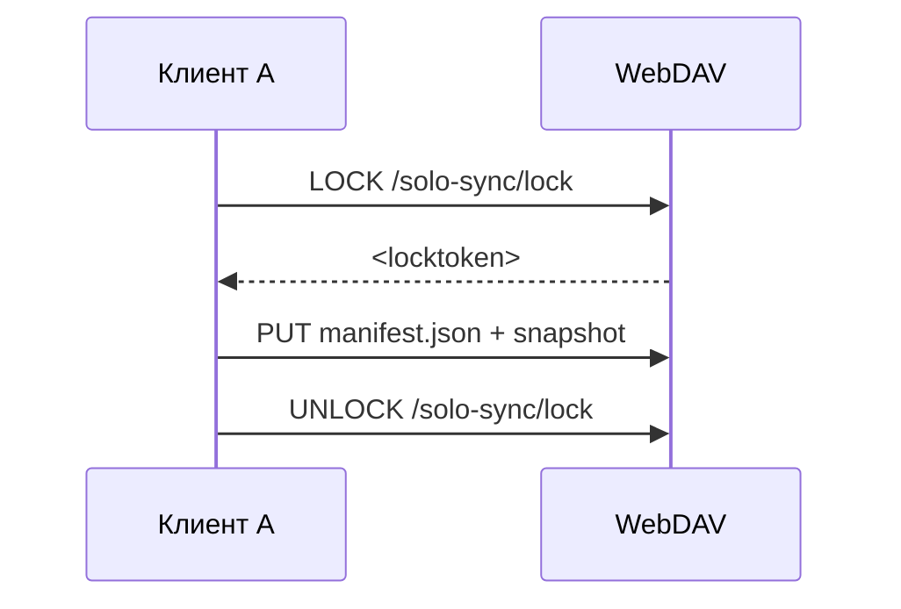
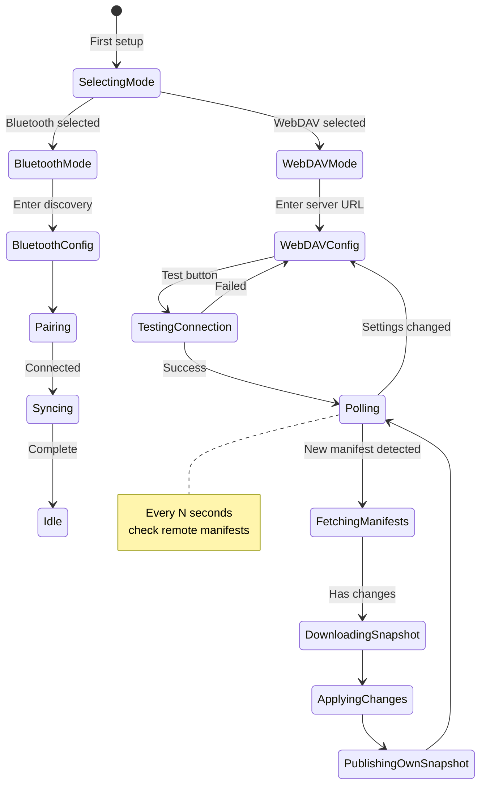

# WebDAV-синхронизация для Solo

## 1. Концепция и мотивация

WebDAV — это HTTP(S)-протокол, который позволяет читать и писать файлы на удалённом сервере. Мы используем его **только как канал передачи данных** (relay), без хранения какого-либо состояния на сервере.

### Как это работает

```
┌─────────────────┐         ┌─────────────────┐
│  Клиент A        │         │  Клиент B        │
│  (Electron/Web)  │         │  (Android/Web)   │
│                   │         │                   │
│  1. Формирует     │         │  1. Периодически  │
│     следок        │         │     проверяет     │
│     (snapshot)    │         │     WebDAV        │
│  2. Пишет на      │         │  2. Забирает     │
│     WebDAV        │         │     следок        │
│  3. Ждёт ответа   │         │  3. Применяет     │
│     от другого    │         │     изменения     │
│     клиента       │         │  4. Публикует     │
│                   │         │     свой следок   │
└────────┬──────────┘         └────────┬──────────┘
         │                             │
         │         ┌─────────┐        │
         └────────►│ WebDAV  │◄───────┘
                   │ Сервер  │
                   │ (канал) │
                   └─────────┘
```

**Важно**: WebDAV сервер не хранит данные приложения. Он используется исключительно как HTTP-relay для обмена бинарными слепками между клиентами. Сервер может быть любой: Nextcloud, ownCloud, любой generic WebDAV сервер.

---

## 2. Сравнение: Bluetooth vs WebDAV

| Характеристика | Bluetooth (P2P) | WebDAV (relay) |
|---------------|----------------|----------------|
| **Транспорт** | RFCOMM (Bluetooth Classic) | HTTP/HTTPS (WebDAV) |
| **Платформы** | Electron + Android (через native bridge) | Все (Electron, Web, Android) |
| **Скорость** | ~1-3 Mbps | Зависит от сети (обычно быстрее) |
| **Дальность** | ~10 метров | Любая (через интернет) |
| **Pairing** | PIN/подтверждение | URL + пароль WebDAV |
| **Надёжность** | Средняя (радиопомехи) | Высокая (HTTP) |
| **Фоновая работа** | Сложно (foreground service) | Просто (HTTP-запросы) |
| **Установка** | Встроенный Bluetooth | Любой WebDAV сервер |

---

## 3. Протокол поверх WebDAV

### 3.1 Структура на WebDAV

Каждое устройство публикует свой "слепок" (snapshot). Используем фиксированные пути:

```
/webdav-root/
├── .solo-sync/
│   ├── lock                    # Флаг: идёт синхронизация
│   ├── device-<UUID-A>/
│   │   ├── manifest.json       # MANIFEST файлов устройства
│   │   ├── snapshot.tar.gz     # Бинарный слепок (заархивированные файлы)
│   │   └── snapshot.sha256     # Контрольная сумма
│   └── device-<UUID-B>/
│       ├── manifest.json
│       ├── snapshot.tar.gz
│       └── snapshot.sha256
```

### 3.2 Формат manifest.json

```json
{
  "deviceId": "solo:abc123",
  "deviceName": "My Laptop",
  "platform": "electron",
  "snapshotVersion": 3,
  "createdAt": 1712345678901,
  "files": [
    {
      "fileId": "note-001",
      "version": 5,
      "checksum": "sha256:abc...",
      "modifiedAt": 1712345600000,
      "path": "Notebook1/My Note.html",
      "sizeBytes": 2048
    }
  ],
  "tombstones": [
    {
      "fileId": "note-002",
      "deletedAt": 1712345600001,
      "originalPath": "Notebook1/Old Note.html"
    }
  ]
}
```

### 3.3 Алгоритм синхронизации



### 3.4 Lock-механика (опционально)

Чтобы избежать гонок (оба клиента пишут одновременно), можно использовать lock-файл:



Но для простоты на первой итерации: **без lock'ов**. Если два клиента одновременно опубликуют — последний победит (LWW по timestamp манифеста).

---

## 4. Архитектура кода

### 4.1 Принцип: Abstract Transport Layer

Текущий код жёстко завязан на Bluetooth. Нужно сделать абстрактный транспортный слой.

```
┌──────────────────────────────────────────────┐
│              Web Layer (UI)                   │
│  ┌────────────────────────────────────────┐  │
│  │           SyncStore (MobX)             │  │
│  │  - status, conflicts, peers            │  │
│  │  - startSync, stopSync                 │  │
│  │  - discoverPeers, pairDevice           │  │
│  └──────────────┬─────────────────────────┘  │
│                 │                              │
│  ┌──────────────▼─────────────────────────┐  │
│  │         TransportManager                │  │
│  │  - sync mode: bluetooth | webdav       │  │
│  │  - делегирует вызовы активному         │  │
│  │    транспорту                          │  │
│  └──────┬─────────────────────┬───────────┘  │
│         │                     │               │
│  ┌──────▼──────────┐  ┌──────▼───────────┐  │
│  │ BluetoothBridge  │  │  WebDAVClient    │  │
│  │ (IPC/native)     │  │  (HTTP fetch)    │  │
│  └──────┬──────────┘  └──────┬───────────┘  │
│         │                     │               │
├─────────┴─────────────────────┴───────────────┤
│              Native Layer                      │
│  ┌────────────────────────────────────────┐  │
│  │  SyncEngine (существующий)              │  │
│  │  - SyncDatabase                        │  │
│  │  - ConflictResolver                    │  │
│  │  - FileWatcher / BootScanner           │  │
│  │  - BluetoothManager (существующий)      │  │
│  └────────────────────────────────────────┘  │
└──────────────────────────────────────────────┘
```

### 4.2 Новые файлы

```
solo/src/sync/
├── TransportManager.ts        # Изменить: добавить поддержку режимов
├── types.ts                   # Изменить: добавить SyncMode
├── bluetooth/
│   ├── BluetoothTransport.ts  # Выделить из существующего TransportManager
│   └── PeerDiscovery.ts       # Существующий, оставить
├── webdav/
│   ├── WebDAVTransport.ts     # WebDAV реализация транспорта
│   ├── WebDAVClient.ts        # Низкоуровневый HTTP-клиент для WebDAV
│   └── SnapshotManager.ts     # Формирование/распаковка слепков
└── shared/
    └── SyncProtocol.ts        # Общая логика протокола (manifest, diff)
```

### 4.3 Ключевые интерфейсы

```typescript
// Тип режима синхронизации
export type SyncMode = 'bluetooth' | 'webdav';

// Абстрактный транспорт
export interface ISyncTransport {
  readonly mode: SyncMode;
  
  start(): Promise<boolean>;
  stop(): Promise<boolean>;
  getStatus(): SyncStatus;
  
  // Публикация/чтение
  publishSnapshot(snapshot: SyncSnapshot): Promise<boolean>;
  fetchRemoteSnapshots(): Promise<RemoteSnapshot[]>;
  
  // События
  onEvent(callback: (event: SyncEvent) => void): () => void;
  
  destroy(): void;
}
```

### 4.4 WebDAVTransport — логика

```typescript
class WebDAVTransport implements ISyncTransport {
  private config: {
    webdavUrl: string;       // https://server.com/remote.php/dav/files/user/
    username: string;
    password: string;
    deviceId: string;
    deviceName: string;
    dataDir: string;          // Локальная директория с заметками
  };
  
  private pollingInterval: NodeJS.Timeout | null = null;
  private lastCheckTimestamp: number = 0;
  
  // 1. Каждые N секунд проверяет чужие манифесты на WebDAV
  // 2. Если есть новый/изменённый manifest → скачивает snapshot
  // 3. Применяет изменения локально (через SyncEngine)
  // 4. Публикует свой manifest + snapshot
  
  async start(): Promise<boolean> {
    // Начать polling
    this.pollingInterval = setInterval(() => this.poll(), 10000); // 10 сек
    return true;
  }
  
  private async poll(): Promise<void> {
    // 1. Список device-* директорий на WebDAV
    // 2. Для каждой: проверить manifest.json
    // 3. Если новый → скачать snapshot.tar.gz
    // 4. Распаковать, применить diff
    // 5. Опубликовать свой следок
  }
}
```

---

## 5. Настройки в UI

### 5.1 Новые поля в SettingsStore или SyncStore

```typescript
// В SyncStore
class SyncStore {
  syncMode: SyncMode = 'bluetooth';  // bluetooth | webdav
  
  // WebDAV настройки
  webdavUrl: string = '';
  webdavUsername: string = '';
  webdavPassword: string = '';       // хранить в secure storage
  webdavPollInterval: number = 10000; // 10 секунд
  
  setSyncMode(mode: SyncMode): void;
  setWebdavConfig(config: WebDAVConfig): void;
  testWebdavConnection(): Promise<boolean>;
}
```

### 5.2 Компонент WebDAVSettings

Добавить в SettingsModal (таб 'sync'):

- **Режим**: переключатель Bluetooth / WebDAV
- **WebDAV URL**: `<input>` (https://server.com/path)
- **Username**: `<input>`
- **Password**: `<input type="password">`
- **Test Connection**: кнопка с статусом (OK/FAIL)
- **Poll Interval**: `<select>` (5s, 10s, 30s, 60s)

Текущий Bluetooth UI (SyncSettings.tsx) остаётся, но показывается только когда `syncMode === 'bluetooth'`.

### 5.3 SyncStatusBar

Небольшое изменение — показывать иконку в зависимости от режима:
- Bluetooth: иконка Bluetooth (как сейчас)
- WebDAV: иконка Cloud/Globe

---

## 6. План имплементации (шаги)

| № | Шаг | Файлы | Описание |
|---|-----|-------|----------|
| 1 | **Добавить SyncMode в типы** | `src/sync/types.ts`, `shared/types.ts`, `electron/sync/types.ts` | Добавить `SyncMode = 'bluetooth' \| 'webdav'` и `ISyncTransport` интерфейс |
| 2 | **Рефакторинг TransportManager** | `src/sync/TransportManager.ts` | Сделать абстрактным: принимает `ISyncTransport` в конструктор. Делигирует все вызовы активному транспорту |
| 3 | **WebDAV HTTP-клиент** | `src/sync/webdav/WebDAVClient.ts` | Низкоуровневые методы: `listDir`, `putFile`, `getFile`, `deleteFile`, `checkConnection` |
| 4 | **WebDAV SnapshotManager** | `src/sync/webdav/SnapshotManager.ts` | Формирование/распаковка `.tar.gz` слепков. Построение манифеста |
| 5 | **WebDAVTransport** | `src/sync/webdav/WebDAVTransport.ts` | Реализация `ISyncTransport`. Polling, публикация, применение |
| 6 | **BluetoothTransport (рефакторинг)** | `src/sync/bluetooth/BluetoothTransport.ts` | Выделить логику из текущего TransportManager в наследника `ISyncTransport` |
| 7 | **SyncStore: поддержка режимов** | `src/stores/SyncStore.ts` | `syncMode`, `setSyncMode`, WebDAV-настройки. Управление жизненным циклом транспорта |
| 8 | **UI: WebDAV Settings** | `src/components/Sync/WebDAVSettings.tsx`, обновить `Sync.css` | Форма настроек WebDAV, кнопка Test Connection |
| 9 | **UI: переключатель режимов** | Обновить `SyncSettings.tsx` | Селектор Bluetooth/WebDAV в табе синхронизации |
| 10 | **UI: SyncStatusBar** | `src/components/Sync/SyncStatusBar.tsx` | Иконка Cloud для WebDAV |
| 11 | **Secure Storage** | `nativeBridge.ts`, `preload.ts` | Пароль WebDAV хранить в `safeStorage` (Electron) / `EncryptedSharedPreferences` (Android). Через `saveSecure / loadSecure` API |
| 12 | **Проверка и тестирование** | — | Проверить: публикация → другой клиент забирает → diff работает |

---

## 7. Примечания по безопасности

1. **Пароль WebDAV** — хранить в secure storage платформы (Electron `safeStorage`, Android `EncryptedSharedPreferences`)
2. **HTTPS обязателен** — без шифрования данные передаются открытым текстом
3. **Сервер не хранит данные** — snapshot.tar.gz можно удалять после прочтения (TTL), но для простоты оставим. Пользователь сам управляет сервером
4. **Никакого состояния на сервере** — все данные временные. Если сервер очистить — синхронизация просто начнётся заново

---

## 8. Диаграмма состояний



---

## 9. Зависимости

- **webdav** (npm-пакет) или написать простой HTTP-клиент самостоятельно используя `fetch`. Второе предпочтительнее, чтобы не добавлять лишних зависимостей. WebDAV использует стандартные HTTP-методы: `PROPFIND` (список), `GET` (чтение), `PUT` (запись), `DELETE` (удаление).
- Для архивации: `pako` (gzip в браузере) или использовать нативную `Compression Streams API`. На Electron — можно использовать `zlib` (встроенный).

---

## 10. Критерии готовности

1. В настройках синхронизации есть переключатель Bluetooth / WebDAV
2. При выборе WebDAV появляются поля: URL, username, password, poll interval
3. Кнопка "Test Connection" проверяет доступность WebDAV сервера
4. Клиент публикует manifest.json + snapshot.tar.gz на WebDAV
5. Клиент забирает чужие snapshot'ы и применяет изменения
6. Конфликты разрешаются по LWW (через существующий ConflictResolver)
7. Пароль хранится в secure storage
8. При переключении режима обратно на Bluetooth — всё работает как раньше
